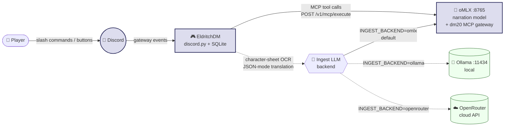
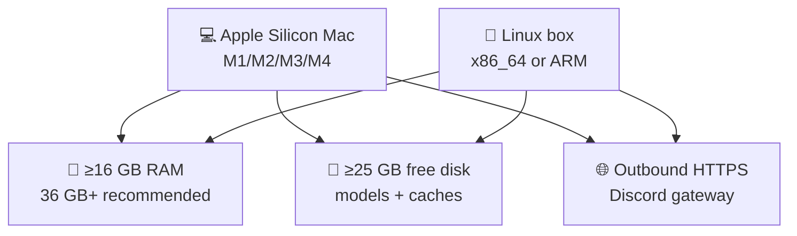
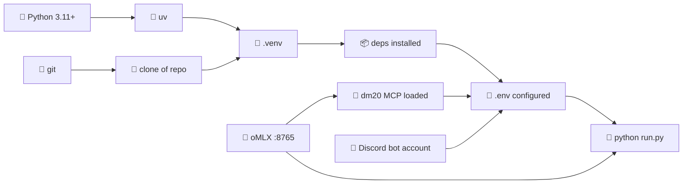
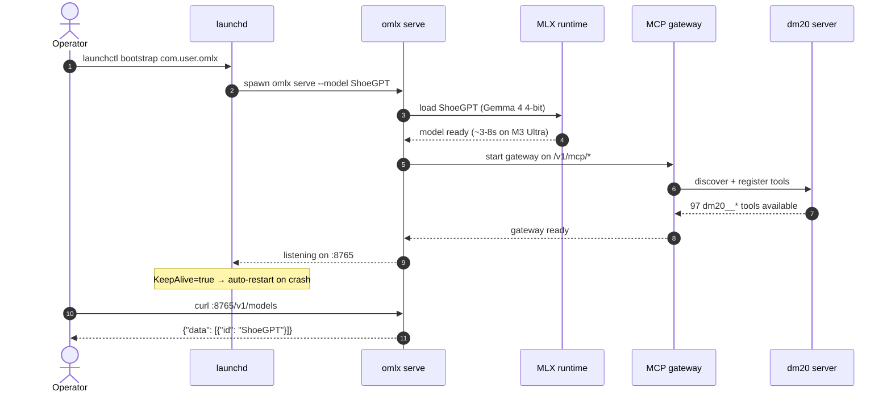
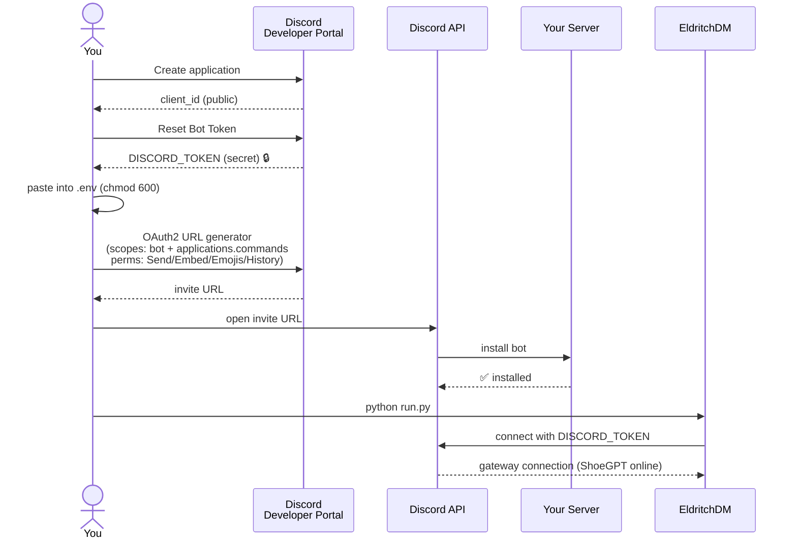
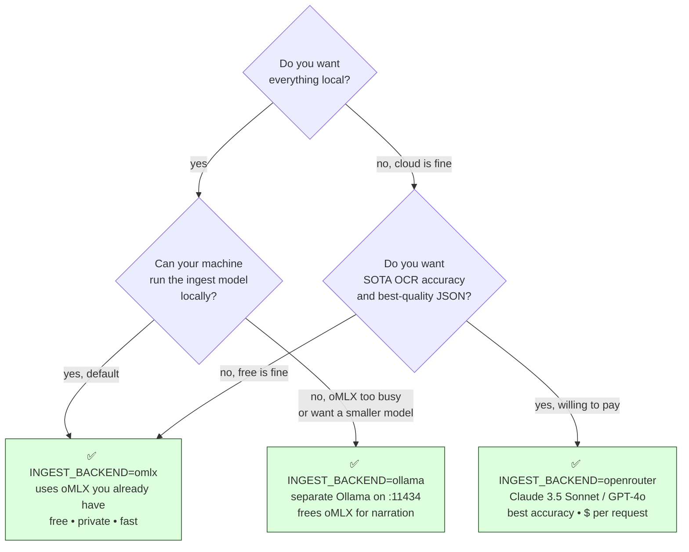
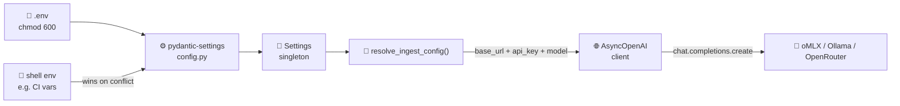
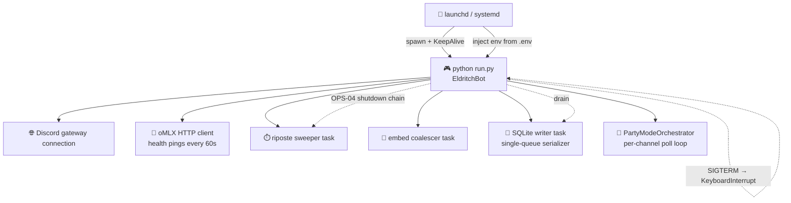

<!-- generated-by: gsd-doc-writer -->
# 🐉 EldritchDM — INSTALL.md

> 🧭 **The canonical "I want to install this myself" document.** From zero to "ShoeGPT just narrated the first room of my dungeon" — Apple Silicon Mac or Linux box, never installed an MCP server or local LLM before. This guide walks you all the way through.

> 📜 EldritchDM is Apache 2.0 licensed (patent grant included). Use it, fork it, host it for friends. See [`LICENSE`](LICENSE).

---

## 🎯 Hero — what you're installing



EldritchDM is a Discord bot that runs full D&D 5e games. To run it, you need **three components** reachable at the same time:

1. **🧠 oMLX** — your local LLM server. Hosts BOTH the narration model (`ShoeGPT`) AND the [dm20-protocol](https://github.com/Polloinfilzato/dm20-protocol) MCP rules engine. Listens on `:8765`.
2. **🎲 dm20-protocol** — the D&D 5e math/state engine, exposed by oMLX as MCP tools. **Always co-located with oMLX. Always.**
3. **🤖 Discord** — a bot account + token from [discord.com/developers/applications](https://discord.com/developers/applications).

> 🛑 **The most likely point of confusion, said once now and again later:** dm20 is **always at the oMLX endpoint**. Switching `INGEST_BACKEND=ollama` or `INGEST_BACKEND=openrouter` only changes where character-sheet OCR translation happens — it does **NOT** move dm20. You still need oMLX running locally for the rules engine. Burn this into your brain. 🔥

> 🔗 **Other docs in this set:**
> - [`docs/TROUBLESHOOTING.md`](docs/TROUBLESHOOTING.md) — FAQ for the most common operator-pain symptoms across v1.0-v1.11.
> - [`docs/UPGRADE.md`](docs/UPGRADE.md) — version-to-version upgrade notes (v1.0 → v1.11).
> - [`CHANGELOG.md`](CHANGELOG.md) — rolling release log (v1.0 → v1.11).

---

## 🛠️ Prerequisites

### Hardware



| Resource | Minimum | Recommended | Why |
|---|---|---|---|
| 🖥️ Platform | Apple Silicon Mac (M1+) | M2/M3 Pro or Ultra | `mlx-lm` is Apple-Silicon-only. Linux self-hosters can swap in Ollama 0.19+ MLX backend OR point at a remote macOS oMLX. |
| 🧠 RAM | 16 GB unified | 36 GB+ | 4B model fits in 16 GB; default `ShoeGPT` (Gemma 4 4-bit) wants 36 GB headroom. |
| 💾 Disk | 25 GB free | 50 GB free | Models + caches + SQLite + logs. Models stick around. |
| 🌐 Net | Outbound HTTPS | + IPv6 | Discord gateway. No inbound ports required (no public endpoints). |

### Software

| Dependency | Why | Get it |
|---|---|---|
| 🐍 **Python 3.11+** (3.11 or 3.12) | Runtime — `TaskGroup`, `tomllib`, faster CPython | `brew install python@3.11` or your distro's `python3.11` |
| 🧱 **git** | Clone the repo | `xcode-select --install` on Mac; package manager on Linux |
| 🚀 **`uv`** (strongly recommended) | 10–100x faster than pip; hermetic venvs | `curl -LsSf https://astral.sh/uv/install.sh \| sh` |
| 🧠 **oMLX** | Local LLM server + MCP gateway | See [Component 1](#-deep-install--component-1-omlx-always-required) |
| 🎲 **dm20-protocol** | D&D 5e engine (MCP server inside oMLX) | See [Component 2](#-deep-install--component-2-dm20-protocol) |
| 🤖 **Discord bot token** | You knew this was coming | See [Component 3](#-deep-install--component-3-discord-bot-account) |

### Dependency graph



> 💡 The bot itself is small. **Most of your install time is the LLM stack** (oMLX + downloading a quantized model + getting dm20 loaded as an MCP server). Budget 20–30 minutes the first time, ~5 minutes after that.

---

## ⚡ Quick path — 8 commands

The optimistic happy path. No diagnostics, no troubleshooting. If anything fails, skip to the detailed section linked beside each step.

```bash
# 1) Clone — see "What you're installing" above
git clone https://github.com/shoemoney/EldritchDM.git
cd eldritchdm

# 2) Make sure oMLX + dm20 are reachable on :8765
#    See: "Deep install — Component 1 & 2"
curl -s http://localhost:8765/v1/models | jq .
curl -s http://localhost:8765/v1/mcp/tools | jq '. | length'   # expect ≥ 116

# 3) Get the Python side ready (uv recommended)
./install.sh                # creates .venv, installs deps, smoke-checks oMLX

# 4) Configure .env (paste your DISCORD_TOKEN)
cp .env.example .env && $EDITOR .env

# 5) Bootstrap the local SQLite + 3-stage preflight
python -m eldritch_dm.bootstrap   # exit 0 = ready

# 6) Verify the bot can start without actually starting it
python run.py --check-only        # exit 0 = good to go

# 7) Run the bot
python run.py

# 8) Invite the bot to a Discord server and type /start_game
```

✅ If step 7 prints `🎲 EldritchDM connected as ShoeGPT#xxxx — let the games begin!` and step 8 shows `/start_game` in your Discord channel — **you win**. Skip to [First session walkthrough](#-first-session-walkthrough).

❌ If any step fails — read on. Each component has a dedicated section below.

---

## 🐳 Docker quickstart (one command)

> 🆕 Added in v1.10 (Phase 29 / DEPLOY-01). Containerizes the **bot process only**. oMLX and dm20 MCP still run on the operator's host (Apple Silicon required for `mlx-lm`).

```bash
cp .env.example .env       # then edit DISCORD_TOKEN — and, if oMLX is on the host,
                           # set MLX_BASE_URL=http://host.docker.internal:8765/v1
docker compose up -d
docker compose logs -f eldritch-bot
```

**How the container reaches oMLX / dm20 on the host:**
- macOS / Windows Docker Desktop resolves `host.docker.internal` natively.
- Linux gets parity via `extra_hosts: "host.docker.internal:host-gateway"` declared in [`docker-compose.yml`](docker-compose.yml) (lines 49-52).
- The compose file does **not** bring up oMLX, dm20, or Phoenix — by design (D-221). You bring those up separately on the host.

**Optional observability stack** (Phase 11 / OBS-01, existing artifact):

```bash
docker compose -f docker-compose.observability.yml up -d
```

> 🔗 Hit an issue? See [`docs/TROUBLESHOOTING.md`](docs/TROUBLESHOOTING.md). Coming from an older release? See [`docs/UPGRADE.md`](docs/UPGRADE.md).

---

## 🧠 Deep install — Component 1: oMLX (always required)

**oMLX is required, no matter which `INGEST_BACKEND` you pick later.** It hosts the narration model AND the dm20 MCP gateway. If oMLX is down, the bot is down. If oMLX has no dm20 tools loaded, the bot can't compute any game state. **No exceptions.**

### Install

oMLX lives at [github.com/macabdul9/omlx](https://github.com/macabdul9/omlx). Follow the project's install steps verbatim — the high-level shape is:

```bash
# In a directory you control (e.g. ~/Code/omlx):
git clone https://github.com/macabdul9/omlx.git
cd omlx
./install.sh                # downloads default model into ~/.omlx/models/
```

> 📝 **A common gotcha:** oMLX needs the `mcp` Python SDK installed into oMLX's own virtualenv (not your system Python) for dm20 to register as a tool server. The exact pip command varies by your oMLX install path; on the reference rig it's `/opt/homebrew/opt/omlx/libexec/bin/pip install mcp`. **If you skip this, oMLX starts cleanly but `/v1/mcp/tools` returns 0 tools.** Check the oMLX project README for the current path.

### Start oMLX

```bash
# Foreground (good for first-time debugging):
omlx serve --model ShoeGPT --port 8765

# Or whatever model you have. The bot's OMLX_MODEL default is "ShoeGPT".
```

### Supervise oMLX so it survives reboots

On Apple Silicon, supervise oMLX with **launchd**. The reference rig runs it as `com.user.omlx`:

```text
~/Library/LaunchAgents/com.user.omlx.plist
├── ProgramArguments → ["/opt/homebrew/opt/omlx/bin/omlx", "serve"]
├── RunAtLoad        → true
├── KeepAlive        → true        ← unconditional restart (oMLX has no secrets in env)
├── StandardOutPath  → ~/Library/Logs/omlx.log
└── StandardErrorPath→ ~/Library/Logs/omlx.err
```

Load it:

```bash
launchctl bootstrap gui/$(id -u) ~/Library/LaunchAgents/com.user.omlx.plist
launchctl kickstart -k gui/$(id -u)/com.user.omlx
launchctl list | grep omlx
```

On Linux, supervise with **systemd user units** following the same pattern (the `eldritch-dm.service` example file in [`docs/eldritch-dm.service.example`](docs/eldritch-dm.service.example) is the EldritchDM equivalent — copy the recipe for oMLX).

### Verify oMLX is healthy

```bash
# 1) Is it answering HTTP?
curl -s http://localhost:8765/v1/models | jq .
# Expect: {"data": [{"id": "ShoeGPT", "object": "model", ...}]}

# 2) Is the MCP gateway up + has tools registered?
curl -s http://localhost:8765/v1/mcp/tools | jq '. | length'
# Expect: a number ≥ 116 (97 dm20__ + 4 dice__ + 8 dnd__ + 1 fetch__ + misc)
```

### Sequence of a successful oMLX startup



---

## 🎲 Deep install — Component 2: dm20-protocol

dm20 is the D&D 5e engine — every die roll, HP change, AC check, turn boundary. It's a Python MCP server that **must be loaded inside oMLX**. Once it's there, oMLX exposes its ~97 tools at `/v1/mcp/execute`.

### Install

```bash
git clone https://github.com/Polloinfilzato/dm20-protocol.git
cd dm20-protocol
./install.sh                   # registers dm20 as an oMLX MCP server
```

The dm20 install script edits oMLX's MCP config so that the next time you `omlx serve`, dm20 is started as a subprocess and its tools are advertised through `/v1/mcp/tools`.

### Verify

```bash
# How many dm20__* tools are loaded?
curl -s http://localhost:8765/v1/mcp/tools \
  | jq '[.tools[]? // .[]? | select(.name | startswith("dm20__"))] | length'
# Expect: 97

# List the family roots:
curl -s http://localhost:8765/v1/mcp/tools \
  | jq -r '.tools[]? // .[]? | .name' \
  | grep '^dm20__' | cut -d_ -f3 | sort -u
# Expect: campaigns, characters, combat, content, party, claudmaster, ...
```

### dm20 tool family map

```text
dm20-protocol (~97 MCP tools)
├── 🏰 campaigns/             dm20__create_campaign, dm20__list_campaigns,
│                             dm20__load_adventure, dm20__end_campaign, …
├── 🧙 characters/            dm20__create_character, dm20__import_ddb,
│                             dm20__update_character, dm20__damage, dm20__heal, …
├── ⚔️  combat/                dm20__start_combat, dm20__combat_action,
│                             dm20__end_turn, dm20__apply_condition, dm20__roll_save, …
├── 🎉 party_mode/            dm20__party_push_intent, dm20__party_pop_action,
│                             dm20__party_get_status, dm20__party_close, …
├── 🧑‍🏫 claudmaster/         dm20__claudmaster_create_session,
│                             dm20__claudmaster_get_memory, dm20__claudmaster_set_memory, …
├── 📚 library/               dm20__get_monster, dm20__get_spell, dm20__get_item,
│                             dm20__search_srd, dm20__rulebook_lookup, …
└── 🛠️  misc/                 dm20__check_for_updates, dm20__health, dm20__about
```

> 🧩 **Why this is important:** EldritchDM never reimplements any D&D math. Every mechanical effect — damage, healing, save DCs, turn order — is a `dm20__*` tool call. Read [`docs/ARCHITECTURE.md`](docs/ARCHITECTURE.md) for the contract. Violating it (e.g. computing HP in the bot) will get your PR rejected. 🛡️

---

## 🤖 Deep install — Component 3: Discord bot account

EldritchDM needs a Discord application + bot user + token. Five minutes of clicking.

### Step-by-step

1. Go to [discord.com/developers/applications](https://discord.com/developers/applications). Click **New Application**, give it a name (e.g. *EldritchDM-MyTable*).
2. Sidebar → **Bot**. Click **Reset Token** → **Copy**. Paste it into your `.env` as `DISCORD_TOKEN=...` (mode `600`). **Treat like a password. Never commit.** 🔒
3. Sidebar → **Bot** → scroll to *Privileged Gateway Intents*. EldritchDM does **NOT** require any privileged intents — leave them off. Less attack surface.
4. Sidebar → **OAuth2** → **URL Generator**.
   - **Scopes:** check `bot` AND `applications.commands`.
   - **Bot Permissions:** check *Send Messages*, *Embed Links*, *Use External Emojis*, *Read Message History*.
5. Copy the generated URL. Paste into a browser. Pick your server. Authorize.
6. The bot appears in your server, offline until you `python run.py`.

### Discord OAuth flow



> 🛑 **Token redaction discipline:** never paste your `DISCORD_TOKEN` into chat, paste-bins, or commit it to git. If you do (or even *suspect* you did), open the Developer Portal and click **Reset Token** immediately — old token instantly dies, you generate a new one. The bot's `Settings.__repr__` deliberately redacts the token from logs (`src/eldritch_dm/config.py:90`) for the same reason. Don't undo that.

### Required scopes + permissions cheat sheet

| Scope | Why |
|---|---|
| `bot` | The bot user logs into the gateway as itself |
| `applications.commands` | Slash commands (`/start_game`, `/upload_character_url`, …) appear in the server |

| Permission | Why |
|---|---|
| Send Messages | Post embeds, narration, lobby UI |
| Embed Links | Combat tracker, lobby embed, character review |
| Use External Emojis | The bot uses 🐉🎲🧠⚔️ etc. in embeds |
| Read Message History | Re-attach to persistent View messages after restart |

---

## 🔀 Pick your ingest backend (D-27)

The **ingest backend** is the LLM used to translate a character sheet (OCR'd text or PDF text) into the structured `CharacterSheet` JSON the rules engine consumes. It's the only LLM call where you have meaningful choice — narration is always ShoeGPT on oMLX, math is always dm20.

> 🛑 **Said once already; saying it again because it matters:** `INGEST_BACKEND=ollama` or `INGEST_BACKEND=openrouter` does **NOT** move dm20. dm20 is **always at the oMLX endpoint**, regardless of which ingest backend you choose. You still need oMLX running locally for the rules engine.

### Decision tree



### Comparison

```text
                      OMLX (default)      OLLAMA              OPENROUTER
──────────────────────────────────────────────────────────────────────────────
🚀 latency            ~2–4 s              ~2–5 s              ~3–8 s (round-trip)
💵 cost               free                free                ~$0.001 / sheet
🎯 quality            ★★★☆☆               ★★★☆☆               ★★★★★ (SOTA models)
🔒 privacy            on-device           on-device           sent to provider
🧠 RAM impact         shares with         separate process    none (cloud)
                      narration model     (~5–8 GB extra)
🌐 internet           not required        not required        REQUIRED
🛠️ setup overhead     none (you've got    install Ollama      sign up + API key
                      oMLX already)       + pull a model
```

### Backend A — oMLX (default)

The character ingest model defaults to whatever model `OMLX_MODEL` points at (typically `ShoeGPT`). It uses the same oMLX server you already have running for narration. Zero additional setup.

```bash
# .env additions:
INGEST_BACKEND=omlx                       # (default; can omit)
OMLX_INGEST_MODEL=ShoeGPT                 # optional — defaults to OMLX_MODEL
```

> ⚙️ **Power user knob:** Set `OMLX_INGEST_MODEL=Qwen3.5-4B-MLX-4bit` (or any smaller model loaded in oMLX) to use a faster/smaller model just for character ingest. Narration still uses `OMLX_MODEL`. Useful when ShoeGPT is mid-narration and you don't want OCR translation to fight for KV cache.

### Backend B — Ollama (alternative local)

Install Ollama (`https://ollama.com/download`), pull a model, point `.env` at it. Ollama listens on `:11434` by default.

```bash
# Pull a model good for structured-JSON output:
ollama pull llama3.1:8b-instruct

# Verify Ollama is up + the model is loaded:
curl -s http://localhost:11434/api/tags \
  | jq -r '.models[].name'
# Expect to see: llama3.1:8b-instruct

# .env:
INGEST_BACKEND=ollama
OLLAMA_ENDPOINT=http://localhost:11434/v1
OLLAMA_MODEL=llama3.1:8b-instruct
```

> 💡 **Why not Qwen on Ollama?** You can. Any Ollama model with reliable `format=json` or OpenAI-compatible `response_format=json_object` support works. `llama3.1:8b-instruct` and `qwen2.5:7b-instruct` both pass our ingest corpus.

### Backend C — OpenRouter (cloud)

[OpenRouter](https://openrouter.ai/) is a single API that routes to most commercial frontier models. EldritchDM uses it for character-sheet OCR translation when you want SOTA accuracy and don't mind paying ~$0.001 per ingest.

```bash
# 1) Sign up at openrouter.ai, generate an API key
# 2) .env:
INGEST_BACKEND=openrouter
OPENROUTER_API_KEY=sk-or-v1-xxxxxxxxxxxxxxxxxxxxxxxx
OPENROUTER_MODEL=anthropic/claude-3.5-sonnet
# Other tested model slugs:
#   openai/gpt-4o
#   openai/gpt-4o-mini                   ← cheap, still excellent
#   meta-llama/llama-3.1-70b-instruct    ← open-weight via the OpenRouter network
#   anthropic/claude-3.5-haiku           ← fast + cheap
```

> 🔒 **Privacy reminder:** OpenRouter ships character-sheet text to whichever provider you chose (Anthropic, OpenAI, Meta, etc.). If your players use real names or anything sensitive on their sheets, default to local. The narration LLM (ShoeGPT on oMLX) never leaves your machine regardless.

> 💸 **Cost rough estimate:** a typical character ingest is ~2k input + ~1k output tokens. At Claude 3.5 Sonnet's pricing that's ~$0.01 per ingest; at GPT-4o-mini it's ~$0.0003. You'll spend more on coffee than on character ingests.

---

## 🔑 Configure `.env`

EldritchDM reads its config from a `.env` file at the project root via `pydantic-settings`. Shell env always wins over `.env` content. The complete reference list lives in [`.env.example`](.env.example) and [`docs/CONFIGURATION.md`](docs/CONFIGURATION.md).

```bash
cp .env.example .env
chmod 600 .env
$EDITOR .env
```

### Wiring — how .env reaches the LLM client



### Three complete working `.env` examples

#### 1) All-local (default, recommended)

```bash
# .env — Scenario 1: everything local, oMLX serves narration + dm20 + ingest
DISCORD_TOKEN=your-token-here

OMLX_ENDPOINT=http://localhost:8765/v1
OMLX_MODEL=ShoeGPT
MCP_EXECUTE_URL=http://localhost:8765/v1/mcp/execute
MCP_TOOLS_URL=http://localhost:8765/v1/mcp/tools

INGEST_BACKEND=omlx
# OMLX_INGEST_MODEL=     # leave unset → falls back to OMLX_MODEL

LOG_LEVEL=INFO
LOG_FORMAT=console
```

#### 2) Ollama for ingest, oMLX for everything else

```bash
# .env — Scenario 2: dm20 + narration on oMLX, character OCR on Ollama
DISCORD_TOKEN=your-token-here

# Narration + dm20 — UNCHANGED, dm20 ALWAYS lives at oMLX
OMLX_ENDPOINT=http://localhost:8765/v1
OMLX_MODEL=ShoeGPT
MCP_EXECUTE_URL=http://localhost:8765/v1/mcp/execute
MCP_TOOLS_URL=http://localhost:8765/v1/mcp/tools

# Ingest routed to Ollama
INGEST_BACKEND=ollama
OLLAMA_ENDPOINT=http://localhost:11434/v1
OLLAMA_MODEL=llama3.1:8b-instruct
```

#### 3) OpenRouter for ingest, oMLX for everything else

```bash
# .env — Scenario 3: dm20 + narration on oMLX, character OCR on OpenRouter
DISCORD_TOKEN=your-token-here

# Narration + dm20 — UNCHANGED, dm20 ALWAYS lives at oMLX
OMLX_ENDPOINT=http://localhost:8765/v1
OMLX_MODEL=ShoeGPT
MCP_EXECUTE_URL=http://localhost:8765/v1/mcp/execute
MCP_TOOLS_URL=http://localhost:8765/v1/mcp/tools

# Ingest routed to OpenRouter (cloud)
INGEST_BACKEND=openrouter
OPENROUTER_API_KEY=sk-or-v1-xxxxxxxxxxxxxxxxxxxxxxxx
OPENROUTER_MODEL=anthropic/claude-3.5-sonnet
```

> 📋 **Every variable, every default:** see the annotated reference in [`.env.example`](.env.example) and [`docs/CONFIGURATION.md`](docs/CONFIGURATION.md). The table above only covers the variables relevant to the install path.

### 📋 Env var reference (v1.10 — added since v1.0)

The bot's full env surface is exhaustively documented in [`.env.example`](.env.example). This table covers the variables added or surfaced between v1.0 and v1.10 — the ones you're most likely to set when upgrading. Each row cites the file that actually consumes the variable.

| Variable | Default | Source | Purpose |
|---|---|---|---|
| `DISCORD_TOKEN` | (unset; required) | `Settings.discord_token` ([`src/eldritch_dm/config/__init__.py`](src/eldritch_dm/config/__init__.py)) | Discord bot token. Bot exits **4** if missing (Phase 7 SAFETY-03). |
| `DISCORD_GUILD_IDS` | `""` | `Settings.discord_guild_ids` | CSV of guild IDs for instant slash-command sync. Empty → global. |
| `DISCORD_OWNER_ID` | `None` | `Settings.discord_owner_id` (alias `DISCORD_OWNER_ID`) | Owner Discord user ID; receives budget + degraded-mode DMs (Phase 22 / OPQOL-02 / D-170). |
| `ELDRITCH_DB_PATH` | `./eldritch.sqlite3` | `Settings.eldritch_db_path` | SQLite DB path (WAL journaling). |
| `DM20_MCP_URL` | falls back to `OMLX_ENDPOINT` | [`src/eldritch_dm/tools/backfill_pc_classes.py`](src/eldritch_dm/tools/backfill_pc_classes.py) | Override for the dm20 MCP endpoint used by `eldritch-dm-backfill-pc-classes` (D-48). |
| `OBSERVABILITY_ENABLED` | `false` | [`src/eldritch_dm/observability/tracer.py:39`](src/eldritch_dm/observability/tracer.py) (`os.environ.get`) | When `true`, OTel tracing wires up; otherwise the observability tree is a lazy no-op (Phase 11 / OBS-01). |
| `MONSTER_DRIVER` | `smart` | `Settings.monster_driver` (alias `MONSTER_DRIVER`) | `smart` / `random` / `mixed`. `random` is the v1.0 escape hatch (Phase 10 / D-52). |
| `NARRCACHE_ENABLED` | `false` | `Settings.narrcache_enabled` (alias `NARRCACHE_ENABLED`) | Opt-in narration cache; off by default (Phase 18 / D-129 — mechanical-honesty contract). |
| `MCPCACHE_L2_ENABLED` | `false` | `Settings.mcpcache_l2_enabled` (alias `MCPCACHE_L2_ENABLED`) | Opt-in L2 SQLite cache. L1 is on by default (Phase 16 / D-117). |
| `MONSTER_MEMORY_PERSIST` | `false` | `Settings.monster_memory_persist` (alias `MONSTER_MEMORY_PERSIST`) | Opt-in cross-restart monster memory (Phase 21 / D-160). |
| `ELDRITCH_DAILY_LLM_BUDGET_USD` | `5.00` | [`src/eldritch_dm/tools/cost_report.py:84`](src/eldritch_dm/tools/cost_report.py) | Daily LLM-spend ceiling used by `eldritch-dm-cost-report` (Phase 13 / MON-03). |
| `STREAM_ENABLED` | `true` | `Settings.stream_enabled` (alias `STREAM_ENABLED`) | When `true`, SmartMonsterDriver emits the "🤔 sizing up the party…" indicator (Phase 19 / STREAM-03). Set `false` for v1.5 silent behavior. |

### 🛠️ Console scripts (after `pip install -e .`)

Pulled verbatim from `[project.scripts]` in [`pyproject.toml`](pyproject.toml):

| Command | Module | Use case |
|---|---|---|
| `eldritch-dm` | `eldritch_dm.bot.__main__:main` | The bot entry point. Equivalent to `python -m eldritch_dm.bot`. |
| `eldritch-dm-backfill-pc-classes` | `eldritch_dm.tools.backfill_pc_classes:main` | v1.0→v1.1 upgrade: populates `pc_classes` for existing characters so Riposte fires (Phase 9 / TD-3). |
| `eldritch-dm-eval` | `eldritch_dm.eval.cli:main` | LLM-as-judge tactical scoring runner (Phase 12 / EVAL-03). |
| `eldritch-dm-cost-report` | `eldritch_dm.tools.cost_report:main` | Daily LLM-spend report from the local span buffer (Phase 13 / MON-03). Honors `ELDRITCH_DAILY_LLM_BUDGET_USD`. |
| `eldritch-dm-cache-clear` | `eldritch_dm.tools.cache_clear:main` | Operator cache-purge for the character snapshot cache (Phase 17 / CHARCACHE-03). |
| `eldritch-dm-cache-disable` | `eldritch_dm.tools.cache_disable:main` | Operator runtime disable/enable for narration cache (Phase 18 / NARRCACHE-03). |
| `eldritch-dm-cache-stats` | `eldritch_dm.tools.cache_stats:main` | Print narration cache hit/miss + size (Phase 18 / NARRCACHE-03). |
| `eldritch-dm-perf-baseline` | `eldritch_dm.tools.perf_baseline:main` | Run hot-path profiler + diff against committed baseline (Phase 28 / TUNE-02 / D-218). Exit codes 0/1/2. |

### 📦 Optional dependency groups

Pulled verbatim from `[project.optional-dependencies]` in [`pyproject.toml`](pyproject.toml):

| Group | Install | Contents | When to install |
|---|---|---|---|
| `dev` | `pip install -e ".[dev]"` | pytest + pytest-asyncio + pytest-cov + pytest-mock + ruff + respx + import-linter + syrupy + reportlab | Contributing to EldritchDM or running the test suite. |
| `mac-ocr` | `pip install -e ".[mac-ocr]"` | `ocrmac>=1.0,<2.0` (Apple Vision via PyObjC) | macOS 10.15+ — primary OCR for character-sheet ingest. |
| `linux-ocr` | `pip install -e ".[linux-ocr]"` | `easyocr>=1.7,<2.0` | Linux / cross-platform OCR fallback. The OCR test skip-gate (Phase 14 / FLAKE-01) auto-skips OCR tests when neither is installed. |
| `observability` | `pip install -e ".[observability]"` | opentelemetry-api/sdk/exporter-otlp-proto-http + prometheus_client | Required to actually emit spans/metrics when `OBSERVABILITY_ENABLED=true` (Phase 11 / OBS-01; Phase 13 / MON-01). |

Extras can be combined, e.g. `pip install -e ".[dev,mac-ocr,observability]"`.

---

## 🩺 Bootstrap & verify (preflight)

EldritchDM ships a **3-stage preflight** (`src/eldritch_dm/bootstrap.py`) that you can run **without** a `DISCORD_TOKEN`. This is deliberate (Phase 5 D-26): verify your local infrastructure first, then paste the token.

```bash
# Bootstrap the local SQLite + run preflight
python -m eldritch_dm.bootstrap

# Or via run.py (same preflight, plus token check):
python run.py --check-only
```

### Successful run looks like

```text
preflight_schema_ok          path=./eldritch.sqlite3
preflight_omlx_ok            endpoint=http://localhost:8765/v1 model_count=1 loaded=['ShoeGPT']
preflight_dm20_ok            mcp_tools_url=http://localhost:8765/v1/mcp/tools tool_count=116 dm20_count=97
preflight_ok
# → process exits 0
```

If `python run.py --check-only` (the bot-launch boundary) also passes, you'll additionally see:

```text
run_check_only_mode
run_check_only_complete      exit_code=0
```

### Preflight exit codes

| Code | Constant | Meaning | First thing to try |
|---|---|---|---|
| `0` | `EXIT_OK` | All three stages passed. 🎉 | `python run.py` |
| `1` | `EXIT_OMLX_UNREACHABLE` | Couldn't reach `OMLX_ENDPOINT/models` | `curl :8765/v1/models` — is oMLX up? |
| `2` | `EXIT_DM20_NOT_LOADED` | oMLX is up but `/v1/mcp/tools` lists 0 `dm20__*` tools | The `mcp` SDK isn't in oMLX's venv. See [`docs/dm20-troubleshooting.md`](docs/dm20-troubleshooting.md). |
| `3` | `EXIT_SCHEMA_FAIL` | Local SQLite schema bootstrap raised | Check `ELDRITCH_DB_PATH` is writable, disk not full |
| `4` | `EXIT_MISSING_TOKEN` | `run.py` invoked without `DISCORD_TOKEN` set | `cp .env.example .env && $EDITOR .env` |

> 🧠 **Schema-first ordering is deliberate:** preflight runs the local SQLite schema bootstrap **before** any network I/O, so a permissions / disk-full failure surfaces before you waste 5 seconds waiting for HTTP timeouts. See `src/eldritch_dm/bootstrap.py:78–95`.

---

## 🏃 Run the bot

Three equivalent entry points — pick whichever fits your muscle memory:

```bash
python run.py                     # project-root entrypoint (preferred for self-host)
python -m eldritch_dm.bot         # module entrypoint (Phase 1-4 muscle memory)
eldritch-dm                       # PATH-installed CLI from `uv pip install -e .`
```

All three converge on the same `EldritchBot(settings)` instance.

### Foreground (interactive) — `python run.py`

What you'll see:

```text
preflight_schema_ok           path=./eldritch.sqlite3
preflight_omlx_ok             endpoint=http://localhost:8765/v1 loaded=['ShoeGPT']
preflight_dm20_ok             tool_count=116 dm20_count=97
preflight_ok
🎲 EldritchDM connected as ShoeGPT#xxxx — let the games begin!
view_registry_restored        n_views=0
orchestrator_resume_complete  channels=[]
```

Hit `Ctrl+C` (or `kill -TERM <pid>`) any time. Shutdown flows through OPS-04 — riposte sweeper stops, embed coalescer flushes, DB writer queue drains, then `bot.close()`. Restart and everything resumes — HP, turn order, riposte timers, persistent buttons.

### Background — macOS (launchd)

```bash
bash scripts/install-launchd.sh

# Verify:
launchctl list | grep eldritch
# tail logs:
tail -f eldritch-dm.log
```

This script substitutes `{PROJECT_DIR}` placeholders in [`docs/launchd.plist.example`](docs/launchd.plist.example) with `$PWD`, copies the rendered plist to `~/Library/LaunchAgents/com.shoemoney.eldritch-dm.plist`, and `launchctl bootstrap`s it. **Idempotent** — running it again `bootout`s the previous instance first.

### Background — Linux (systemd)

```bash
mkdir -p ~/.config/systemd/user
sed "s|{PROJECT_DIR}|$PWD|g" docs/eldritch-dm.service.example \
  > ~/.config/systemd/user/eldritch-dm.service
systemctl --user daemon-reload
systemctl --user enable --now eldritch-dm

# Tail:
journalctl --user -u eldritch-dm -f
```

### Supervision tree



> 🛑 **Secrets never go into the plist or systemd unit.** LaunchAgent plists are world-readable on macOS by default; systemd unit files default to mode `0644`. `DISCORD_TOKEN` MUST come from a runtime-loaded `.env` (mode `0600`) via `Settings()`. Both example files are deliberately secret-free.

---

## 🎲 First session walkthrough

Once the bot is online, here's what a fresh session looks like end-to-end. Run this once and you'll have your mental model.

### Discord side

```text
[me]    /start_game name: The Cursed Vault
[bot]   🎲 Campaign created: The Cursed Vault
        ┌─────────────────────────────────────────┐
        │ 🪦 The Cursed Vault                     │
        │ Status: lobby — waiting for players     │
        │ Players: 0 / 6                          │
        │                                          │
        │  [ ✅ Ready ]   [ 📷 QR for browser ]   │
        └─────────────────────────────────────────┘

[me]    /upload_character_url url: https://www.dndbeyond.com/characters/12345
[bot]   ⏳ Importing…
[bot]   ✅ Sigfrid the Battle Master Fighter — Lv 5 — HP 47/47 — AC 18
        [ ✅ Confirm ]  [ ✏️ Edit ]

[me]    [click ✅ Ready]
[bot]   ⚔️ All players ready — EXPLORATION begins
[bot]   "You stand at the threshold of the Cursed Vault. The torches gutter…"
```

### First 60 seconds — timeline

```text
t=0s    /start_game name:"My Campaign"
        ┃
t=0.2s  ┃ defer(thinking=True)                ← Discord 3s gate
        ┃ dm20__create_campaign  (MCP)
t=0.8s  ┃ dm20__claudmaster_create_session (MCP)
        ┃ dm20__party_open (MCP, opens Party Mode queue on :8080)
t=1.4s  ┃ INSERT INTO channel_sessions  (SQLite via writer queue)
t=1.6s  ┃ followup.send(lobby_embed)  ← user sees the lobby
        ↓
t=8s    /upload_character_url url:…
        ┃
t=8.2s  ┃ defer(thinking=True)
        ┃ dm20__import_ddb (MCP) — DDB scrape
t=11s   ┃ sanitizer → review modal (D-26 confidence ≥ 0.6 → review path)
        ↓
t=20s   [click Ready]
        ┃
t=20.4s ┃ defer(thinking=True)
        ┃ dm20__party_push_intent (ready) — MCP
        ┃ orchestrator.start_orchestrator_for_channel(...)  ← G-1 fix
        ┃ Bot enters EXPLORATION state
t=21s   ┃ Orchestrator polls dm20__party_pop_action every 250ms
t=22s   ┃ First narrative chunk arrives ← ShoeGPT narrates
        ↓
t=60s   ┃ Players type actions → modals → sanitize → push_intent →
        ┃ batch 30s window → pop_action → narrate → embed update
```

For the full session reference, see [README.md "First Session in 10 Minutes"](README.md#-first-session-in-10-minutes).

---

## 🩺 Troubleshooting

> 🔗 **The full operator FAQ now lives in [`docs/TROUBLESHOOTING.md`](docs/TROUBLESHOOTING.md)** — symptom → diagnose → fix for ≥12 of the most-common operator gotchas surfaced across v1.0-v1.10. Quick jump:
>
> - "Bot says DM is offline" → [docs/TROUBLESHOOTING.md#bot-says-dm-is-offline](docs/TROUBLESHOOTING.md#bot-says-dm-is-offline)
> - "OCR tests are skipping" → [docs/TROUBLESHOOTING.md#ocr-tests-are-skipping](docs/TROUBLESHOOTING.md#ocr-tests-are-skipping)
> - "Bot exits with code 4" (`DISCORD_TOKEN` missing) → [docs/TROUBLESHOOTING.md#bot-exits-with-code-4-discord_token-missing](docs/TROUBLESHOOTING.md#bot-exits-with-code-4-discord_token-missing)
> - "Cache hit rate is 0" → [docs/TROUBLESHOOTING.md#cache-hit-rate-is-zero](docs/TROUBLESHOOTING.md#cache-hit-rate-is-zero)

The full set of install-path bootstrap exit-code diagnostics (exits 1/2/4 etc.) is preserved verbatim there. The legacy inline copy that used to live in this section has been moved, not deleted — anchor links from third-party docs continue to resolve via this header.

> 📦 **For deeper diagnostics, also see** [`docs/dm20-troubleshooting.md`](docs/dm20-troubleshooting.md) (preflight exit codes 1/2), [`docs/character-ingest-formats.md`](docs/character-ingest-formats.md), and the [README troubleshooting section](README.md#-troubleshooting) (Discord-side issues).

---

## 🖥️ Hardware tier guidance

| Tier | Hardware | Narration model | Ingest backend | Notes |
|---|---|---|---|---|
| 🏔️ **Minimum** | 16 GB Apple Silicon (M1/M2 base) | `Qwen3.5-4B-MLX-4bit` on oMLX | Ollama `llama3.1:8b-instruct` | Narration noticeably terser. Ingest separate so oMLX has KV-cache headroom. Mechanics 100% intact (dm20 is deterministic). |
| ⛰️ **Recommended** | M2/M3 Pro+ with 32–36 GB | `ShoeGPT` (Gemma 4 4-bit) | Same — oMLX (default) | Sweet spot. ~90 tok/s narration, ~6s character ingest. Ships as the documented default. |
| 🏔️ **Premium** | M3 Ultra / 64+ GB | `ShoeGPT` full quality | OpenRouter (`claude-3.5-sonnet` or `gpt-4o`) | Best ingest accuracy; trades $0.01/ingest for near-100% schema fidelity on bad scans. |
| ☁️ **Cloud-augmented** | Any Apple Silicon Mac | `ShoeGPT` on local oMLX | OpenRouter (`gpt-4o-mini`) | ~$0.0003/ingest. Local narration stays private; only OCR text leaves. |
| 🐧 **Linux best-effort** | Linux box, no Mac | Ollama 0.19+ MLX backend or remote oMLX | Ollama or OpenRouter | Tested but second-class. dm20 needs to live alongside whichever LLM server you choose. |

---

## 🎯 What's next

You've installed EldritchDM. Now what?

- 📘 [README.md — First Session in 10 Minutes](README.md#-first-session-in-10-minutes) — the walkthrough for the very first `/start_game`.
- 🏗️ [`docs/ARCHITECTURE.md`](docs/ARCHITECTURE.md) — **the *why*** behind the three-brain design, the persistent-view discipline, the sanitizer contract, the OPS-04 shutdown chain.
- 🧑‍💻 [`docs/DEVELOPMENT.md`](docs/DEVELOPMENT.md) — contributor setup: import-linter contracts, the defer-discipline ruff rule, the phase-based workflow.
- 🤝 [CONTRIBUTING.md](CONTRIBUTING.md) — the values, the *non-negotiable* "bot never computes math" rule, PR expectations.
- 📋 [`docs/CONFIGURATION.md`](docs/CONFIGURATION.md) — every env var, every default, every knob.
- 🏁 [`docs/GETTING-STARTED.md`](docs/GETTING-STARTED.md) — the doc-tooling-friendly version of the install.
- 🩺 [`docs/dm20-troubleshooting.md`](docs/dm20-troubleshooting.md) — the deep-dive when preflight exits non-zero.
- 🧾 [`.planning/milestones/v1.0-MILESTONE-AUDIT.md`](.planning/milestones/v1.0-MILESTONE-AUDIT.md) — full transparency about what shipped in v1.0, what didn't, and why (G-3/G-4 deferred to v1.1).

---

## Homebrew Riposte Eligibility

By default, only Battle Master Fighters can Riposte (D&D 5e RAW). To extend
the eligibility set for homebrew classes/subclasses without editing code,
create a YAML file at one of these locations (closest wins):

1. `$ELDRITCH_ELIGIBILITY_YAML` — explicit env-var path (highest precedence)
2. `~/.eldritch/eligibility.yaml` — per-install user file
3. `database/eligibility.yaml` — in-repo default. **Do not edit if you want
   vanilla v1.0 behavior** — create a file at one of the tiers above instead.

### Extend (recommended default)

Adds your subclasses to the RAW set — Battle Master Fighter remains eligible:

```yaml
version: 1
mode: extend
eligible:
  fighter:
    - echo knight     # homebrew subclass
  rogue:
    - swashbuckler    # third-party content
```

Result: Battle Master Fighter, Echo Knight Fighter, AND Swashbuckler Rogue
can all Riposte.

### Replace (advanced — wipes RAW defaults)

Fully overrides the RAW set. Battle Master Fighter will **no longer** be
eligible unless you list it explicitly:

```yaml
version: 1
mode: replace
eligible:
  fighter:
    - battle master   # MUST include if you want to keep v1.0 default
    - echo knight
```

> ⚠️ Footgun: an empty `eligible: {}` block under `mode: replace` produces an
> empty eligibility set — **nobody can Riposte**. This is intentional ("no
> one is eligible" is a legitimate house rule) but rarely what you want.

### Failure semantics

If the YAML file is missing, malformed, or fails schema validation,
EldritchDM logs a `structlog.warning("eligibility.fallback", reason=...)`
entry and **falls back to the v1.0 default** (Battle Master Fighter only).
The bot will NOT crash — your players can still play. Grep your JSON logs
(`grep eligibility.fallback`) to see what went wrong.

### Caveat — RAW vs RAI

This file extends what **the bot offers** as a Riposte reaction. It does
NOT change what 5e RAW grants. Adding `{ranger: [hunter]}` will let Hunter
Rangers click the Riposte button at your table, but Hunter Rangers do not
have the Riposte maneuver in core rules. You are responsible for confirming
RAW alignment for any homebrew you add.

### Restart-to-apply

Changes are read **once at bot startup**. Restart the bot
(`launchctl unload && launchctl load …` or `systemctl --user restart eldritch-dm`)
to apply edits. Hot-reload is a v1.2 candidate.

---

## v1.0 → v1.1 Upgrade: `pc_classes` Backfill

> 🔗 **The detailed upgrade procedure now lives in [`docs/UPGRADE.md#v10--v11`](docs/UPGRADE.md#v10--v11).** Headline: if you ran v1.0, run `eldritch-dm-backfill-pc-classes` once after upgrading so Riposte fires for legacy PCs (Phase 9 / UPGRADE-01 / closes the v1.0 TD-3 gap). The full flag reference, exit-code table, `--dry-run` flow, and the `subclass=""` caveat are documented in [`docs/UPGRADE.md`](docs/UPGRADE.md), along with every other v1.x → v1.(x+1) step from v1.0 through v1.10.

---

<p align="center">
  <em>"You've crossed the threshold. The torches are lit. ShoeGPT is</em> <strong>waiting…</strong> ⏳<br>
  🐉 <strong>Roll initiative.</strong> 🐉
</p>
