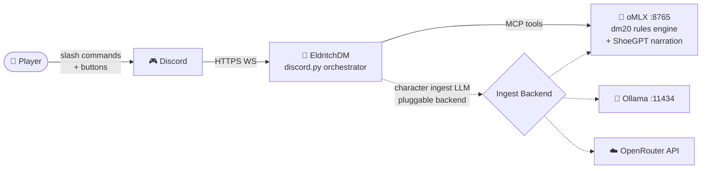
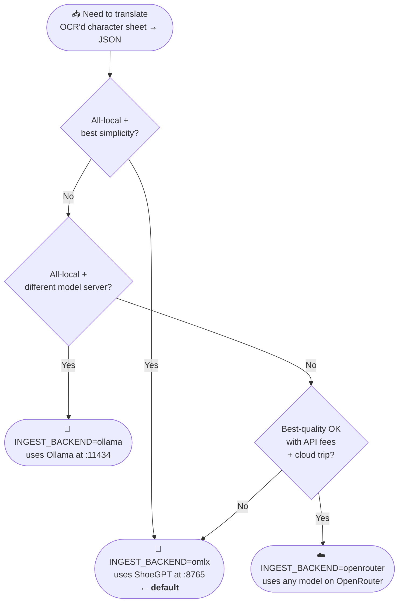
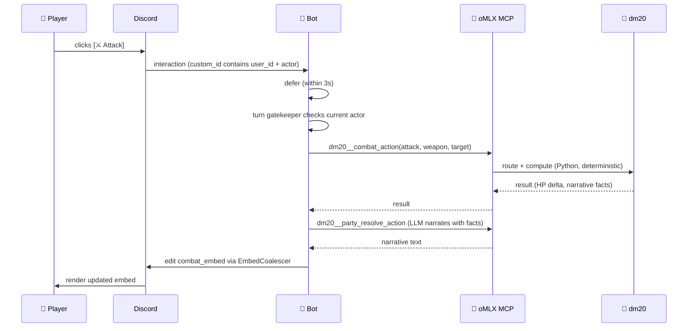

# 🐉 EldritchDM — ShoeGPT, Your Forever Dungeon Master

> 🎲 **An open-source, local-first Discord bot that runs full Dungeons & Dragons 5e games end-to-end with an AI Dungeon Master persona called *ShoeGPT*.** No API bills. No data leaves your machine. No more "sorry can't DM tonight." Just hit `/start_game` and roll initiative.

[](#-license)
[](https://www.python.org/)
[](https://www.apple.com/mac/)
[](#-roadmap)

**Created with ♥ by [Jeremy Schoemaker](https://shoemoney.com)** — open source, Apache 2.0-licensed, contributions welcome. 🤝



> 🚀 **Just want to get it running?** Jump to [`INSTALL.md`](INSTALL.md) for a step-by-step walkthrough with diagrams. This README is the project tour.

---

## 🤔 What is this?

🎭 **EldritchDM** is the missing piece between "I want to play D&D" and "the whole party can show up at the same time." It's a Discord bot that wears the costume of an evocative, gritty, ancient Dungeon Master named **ShoeGPT** — but underneath that costume is a clockwork brain that *cannot* hallucinate HP, *cannot* forget your conditions, and *cannot* let illegal moves slip through.

🧠 The trick is the **three-brain architecture** (plus a pluggable ingest backend):

| Brain | What it does | Tech |
|---|---|---|
| 🗣️ **The Voice** | Narrates the world, plays NPCs, paints scenes | [oMLX](https://github.com/macabdul9/omlx) running the `ShoeGPT` model (Gemma 4, 4-bit) on Apple Silicon |
| 🧮 **The Brain** | Computes every die roll, HP change, AC check, turn boundary | [`dm20-protocol`](https://github.com/Polloinfilzato/dm20-protocol) — a complete D&D 5e engine exposed as MCP tools |
| 🎮 **The Orchestrator** | This bot — speaks Discord, gatekeeps turns, surfaces timed reactions, ingests character sheets | `discord.py 2.7+` plus a small local SQLite for Discord-specific state |
| 📥 **Ingest Backend** | OCR'd character sheets → structured JSON | Pluggable: oMLX / Ollama / OpenRouter (see [`INSTALL.md`](INSTALL.md)) |

🛡️ **The integrity contract:** ShoeGPT *narrates* what happens, but the math is always done by deterministic Python code. If a goblin hits an AC of 14, you can audit every step. If your fighter rolls a natural 20, the engine doubles the damage dice — not the LLM's imagination.

✨ **The differentiator:** EldritchDM adds Discord-native affordances that no AI-DM product currently ships:

- ⚔️ **Timed reactive Riposte button** — when a monster misses your Battle Master Fighter, an 8-second button appears in the channel; only the targeted PC's Discord user can click it. Click to counter-strike. Survives bot restarts. Pure D&D magic.
- 🔒 **Turn gatekeeping by Discord user ID** — only the current actor can click action buttons. Try out of turn? Ephemeral "❌ Not your turn yet."
- 📸 **Photo & PDF character ingest** — got a scanned sheet from a printed PDF or a phone snap of handwritten stats? OCR pipeline ingests it.
- 🌐 **D&D Beyond URL import** — paste a public character URL, done.
- 💀 **Full state recovery** — kill the bot mid-combat, restart it, all your buttons keep working. HP, initiative, conditions, riposte timers — everything resumes.

---

## 🚀 30-Second Quickstart

```bash
# 1️⃣ Clone
git clone https://github.com/shoemoney/eldritchdm.git
cd eldritchdm

# 2️⃣ Install everything (Python 3.11+, system deps, Python deps)
./install.sh

# 3️⃣ Configure
cp .env.example .env
$EDITOR .env   # ✏️ paste your Discord bot token, confirm oMLX URL

# 4️⃣ Bootstrap the local DB + verify dependencies (3-stage preflight)
python -m eldritch_dm.bootstrap

# 5️⃣ Run — choose any of these three equivalent paths:
python run.py                # project-root entrypoint (preferred for self-host)
python -m eldritch_dm.bot    # module entrypoint (Phase 1-4 muscle memory)
eldritch-dm                  # PATH-installed CLI from `pip install -e .`
```

🎉 Now invite the bot to a Discord server, type `/start_game` in a channel, and let the dice fall.

> 💡 **First time?** Jump to [First Session in 10 Minutes](#-first-session-in-10-minutes) for a step-by-step walkthrough, or open [`INSTALL.md`](INSTALL.md) for the deep guided install with diagrams.

> 🐳 **Prefer Docker?** `docker compose up -d` brings up the whole stack (v1.10+). See [`INSTALL.md`](INSTALL.md) for the bundled `docker-compose.yml` recipe.

---

## 🏗️ Architecture in 60 Seconds

```text
                              ┌──────────────────────────────┐
                              │   👥 You + your D&D party    │
                              │       (Discord channel)      │
                              └──────────────┬───────────────┘
                                             │ slash commands, buttons, modals
                                             ▼
                              ┌──────────────────────────────┐
                              │  🎮 EldritchDM (this repo)   │
                              │  discord.py orchestrator     │
                              │  + tiny local SQLite (WAL)   │
                              │  for channel↔campaign state, │
                              │  view registry, ⏱️ riposte   │
                              │  timers, sanitizer audit     │
                              └──┬──────────────────────────┬┘
                                 │ HTTP — MCP tool calls    │ ingest LLM
                                 │ (gameplay — ALWAYS oMLX) │ (pluggable)
                                 ▼                          ▼
                ┌──────────────────────────────┐  ┌────────────────────────────────────────┐
                │ 🧠 oMLX `:8765`              │  │   📥 Ingest Backend (Pluggable, D-27)  │
                │   ├─ 🗣️  ShoeGPT model      │  │  ┌──────────┐ ┌──────────┐ ┌─────────┐ │
                │   │      (narration)         │  │  │  🧠 oMLX │ │ 🦙 Ollama│ │☁️ Open- │ │
                │   └─ 🛠️  MCP gateway         │  │  │  :8765   │ │  :11434  │ │  Router │ │
                │          /v1/mcp/execute     │  │  │ (default)│ │  (local) │ │  (cloud)│ │
                └──────────────┬───────────────┘  │  └────┬─────┘ └────┬─────┘ └────┬────┘ │
                               │ 116 tools                │            │            │      │
                               │ across 5 servers         └────────────┴────────────┘      │
              ┌────────────┬───┴────────┬──────────────┐  OCR sheet → JSON translator only │
              ▼            ▼            ▼              ▼  └─────────────────────────────────┘
       ┌──────────────┐┌──────────┐┌──────────┐ ┌──────────┐
       │ 🧮 dm20      ││ 🎲 dice  ││ 📚 dnd   │ │ 🌐 fetch │
       │ (97 tools)   ││ (4 tools)││ (8 tools)│ │ (1 tool) │
       │ campaigns,   ││ d20kh1,  ││ SRD,     │ │ HTTP     │
       │ characters,  ││ exploding││ monsters │ │ fetcher  │
       │ combat,      ││ keep-hi, ││ by CR    │ │          │
       │ Claudmaster, ││ etc.     ││          │ │          │
       │ Party Mode,  ││          ││          │ │          │
       │ adventures,  ││          ││          │ │          │
       │ rulebook RAG ││          ││          │ │          │
       └──────────────┘└──────────┘└──────────┘ └──────────┘
```

🧩 **Why this is cool:** because dm20 already implements a complete D&D engine (~70% of what you'd think a custom AI DM needs), EldritchDM doesn't *reimplement* any of it. We just wrap it in a Discord skin, add the timed-reaction UI, and let oMLX narrate. It's the rare "stand on the shoulders of giants" project where the giants are already configured on your laptop.

> 🔑 **Read the diagram carefully:** gameplay (the left column — dm20, dice, dnd, fetch) **always** routes through oMLX. The right column is the ingest backend, which is the *only* swappable piece. Picking Ollama or OpenRouter for ingest does NOT remove the oMLX dependency.

---

## 📋 Prerequisites

Before installing EldritchDM, you need three things running on your machine. The install script will check for them and tell you if anything is missing. 🔍

### 🍎 Required hardware

- 🖥️ **Apple Silicon Mac** (M1/M2/M3/M4). Linux works "best effort" — see below.
- 🧠 **≥16 GB unified memory** for the 7B fallback model. **36 GB+** recommended to run the default `ShoeGPT` (Gemma 4 4-bit).
- 💾 **~25 GB free disk** for models + caches.

### 🛠️ Required software

| Dependency | Why | How to get it |
|---|---|---|
| 🐍 **Python 3.11+** | Runtime | `brew install python@3.11` |
| 🧠 **oMLX server** running on `:8765` | Hosts ShoeGPT + MCP gateway | [github.com/macabdul9/omlx](https://github.com/macabdul9/omlx) |
| 🎲 **dm20-protocol** MCP server exposed via oMLX | The 5e engine | [github.com/Polloinfilzato/dm20-protocol](https://github.com/Polloinfilzato/dm20-protocol) |
| 🤖 **Discord bot token** | You knew this one was coming | [discord.com/developers/applications](https://discord.com/developers/applications) |
| 🔧 **`uv`** (recommended) or `pip` | Python package manager | `curl -LsSf https://astral.sh/uv/install.sh \| sh` |

ℹ️ **Don't have oMLX + dm20 set up yet?** Check the [oMLX docs](https://github.com/macabdul9/omlx) and [dm20-protocol README](https://github.com/Polloinfilzato/dm20-protocol). On Jeremy's reference rig they're supervised by `launchd` as `com.user.omlx` so they survive reboots. The install script will warn you (not fail) if they're not running.

---

## ⚙️ Installation (the Verbose Tour)

### 🤖 The easy way

```bash
./install.sh
```

That's it. The script:

1. 🔎 Checks Python version (must be ≥3.11)
2. 🔎 Checks for `uv` (installs via official script if missing)
3. 🌱 Creates a `.venv/` virtualenv with `uv venv`
4. 📦 Installs all Python dependencies (`discord.py`, `httpx`, `aiosqlite`, `pydantic`, `tenacity`, `structlog`, `ocrmac` on macOS, `PyMuPDF`, `pypdf` as fallback, plus dev deps for tests/lint)
5. 🩺 Pings `:8765/v1/models` to verify oMLX is running and reports which model is loaded (should be `ShoeGPT`)
6. 🩺 Pings `:8765/v1/mcp/tools` to confirm dm20 is exposed (expects ≥97 dm20 tools)
7. 💡 Tells you exactly what to do next (copy `.env.example`, run `bootstrap`, run the bot)

If anything fails, the script tells you why in plain English (no cryptic exit codes). 💬

### 🧙 The "I want to know what's happening" way

If you want to do this by hand:

```bash
# 1) Make sure Python 3.11+ is your interpreter
python3 --version            # → Python 3.11.x or higher

# 2) Install uv if you don't have it (fast, hermetic, friendly)
curl -LsSf https://astral.sh/uv/install.sh | sh
exec $SHELL                  # reload PATH

# 3) Create + activate a virtualenv
uv venv
source .venv/bin/activate

# 4) Install runtime + dev dependencies (when pyproject.toml exists)
uv pip install -e ".[dev,linux-ocr-fallback]"

# 5) (macOS) Install ocrmac native deps
uv pip install ocrmac

# 6) Verify oMLX + dm20 are reachable
curl -s http://localhost:8765/v1/models | jq .
curl -s http://localhost:8765/v1/mcp/tools | jq '. | length'   # should print a number ≥ 116

# 7) Configure
cp .env.example .env
$EDITOR .env

# 8) Initialize local DB
python -m eldritch_dm.persistence.bootstrap

# 9) Launch the bot
python run.py
```

If you see `🎲 EldritchDM connected as ShoeGPT#0001 — let the games begin!` in stdout, you win. 🏆

> 📖 **Want a diagram-rich, hand-held walkthrough?** [`INSTALL.md`](INSTALL.md) covers OS-specific paths (macOS launchd, Linux systemd), backend selection (oMLX / Ollama / OpenRouter), and the full preflight troubleshooting tree.

---

## 🔑 Configuration: the `.env` file

EldritchDM reads its config from environment variables, typically loaded from a `.env` file at the project root. **Never commit your real `.env` to git** — `.gitignore` excludes it by default. 🤫

Copy `.env.example` and edit:

```bash
cp .env.example .env
```

Then open it and fill in the secrets. Every variable, what it does, and a sane default:

| Var | Required | Default | What it does |
|---|---|---|---|
| `DISCORD_TOKEN` | ✅ | — | 🤖 Your Discord bot token. Treat like a password. |
| `OMLX_ENDPOINT` | ❌ | `http://localhost:8765/v1` | 🧠 Base URL of your oMLX server's OpenAI-compatible API |
| `OMLX_MODEL` | ❌ | `ShoeGPT` | 🗣️ Which model id to use for narration. Must already be loaded into oMLX. |
| `MCP_EXECUTE_URL` | ❌ | `http://localhost:8765/v1/mcp/execute` | 🛠️ Endpoint that runs MCP tool calls |
| `MCP_TOOLS_URL` | ❌ | `http://localhost:8765/v1/mcp/tools` | 📜 Endpoint that lists available MCP tools (used by health checks) |
| `ELDRITCH_DB_PATH` | ❌ | `./eldritch.sqlite3` | 💾 Path to the *local* Discord-state SQLite (the small one — not dm20's DB) |
| `LOG_LEVEL` | ❌ | `INFO` | 📝 `DEBUG` / `INFO` / `WARNING` / `ERROR` |
| `LOG_FORMAT` | ❌ | `json` | `json` (structlog JSON for prod) or `console` (pretty colored for dev) |
| `OMLX_HEALTH_INTERVAL` | ❌ | `60` | ⏱️ Seconds between oMLX health pings |
| `OMLX_CIRCUIT_BREAKER_THRESHOLD` | ❌ | `3` | 🔌 Consecutive failures before circuit opens |
| `RIPOSTE_TTL_SECONDS` | ❌ | `8` | 🗡️ How long a riposte button stays clickable |
| `EMBED_EDIT_RATE_LIMIT` | ❌ | `1.0` | 📡 Max Discord embed edits per second per message |
| `MAX_MODAL_INPUT_CHARS` | ❌ | `500` | ✂️ Hard cap on player free-text in modals |
| `PARTY_MODE_PORT` | ❌ | `8080` | 🌐 Port dm20 Party Mode HTTP server listens on |
| `INGEST_BACKEND` | ❌ | `omlx` | 📥 Which backend translates OCR'd character sheets to JSON. `omlx` / `ollama` / `openrouter`. See [`INSTALL.md`](INSTALL.md#-pick-your-ingest-backend-d-27). |
| `INGEST_ENDPOINT` | ❌ | (backend default) | ⚙️ Override the ingest endpoint. Leave blank for the backend default. |
| `INGEST_MODEL_OVERRIDE` | ❌ | (falls back to `OMLX_MODEL`) | ⚙️ Override the ingest model id. For OpenRouter, a full slug like `anthropic/claude-3.5-sonnet`. |
| `OPENROUTER_API_KEY` | ✅* | — | ✅ Required when `INGEST_BACKEND=openrouter`. Get one at [openrouter.ai/keys](https://openrouter.ai/keys). |

*conditional — only required when `INGEST_BACKEND=openrouter`.

The full annotated template lives in [`.env.example`](.env.example).

---

## 🔌 Ingest Backend Selection (v1.0+ D-27)

When a player uploads a character sheet (PNG, JPG, or scanned PDF), EldritchDM runs OCR to get raw text, then asks an LLM to translate that text into a structured JSON character object that dm20 can ingest. **That second step — the OCR-text → JSON translator — is the one piece of the stack where you have a choice.** 🎚️

Three backends are supported, all behind the same internal interface. Pick the one that matches your priorities:



### 📊 Backend comparison

| | 🧠 oMLX (default) | 🦙 Ollama | ☁️ OpenRouter |
|---|---|---|---|
| **Endpoint** | `http://localhost:8765/v1` | `http://localhost:11434/v1` | `https://openrouter.ai/api/v1` |
| **Auth needed** | None | None | API key required |
| **Speed (latency)** | Fast (~4-8s) — already loaded | Fast (~3-7s) — local | Slower (~5-15s) — network round-trip |
| **Cost** | Free | Free | Per-token (varies by model) |
| **Quality** | Good (Gemma 4 4-bit) | Depends on model picked | Best — frontier models available |
| **Privacy** | 🔒 100% local | 🔒 100% local | ⚠️ Character sheet text sent to OpenRouter |
| **Setup steps** | Zero (already required for gameplay) | Install + pull a model | Sign up + paste API key |

### ⚙️ Env snippets

**oMLX (default — nothing to set if you're happy with this):**

```env
# oMLX (default)
INGEST_BACKEND=omlx
```

**Ollama (point at your local Ollama daemon):**

```env
# Ollama
INGEST_BACKEND=ollama
INGEST_MODEL_OVERRIDE=llama3.1:8b-instruct
```

**OpenRouter (use any frontier model — best for hard-to-read handwriting):**

```env
# OpenRouter
INGEST_BACKEND=openrouter
OPENROUTER_API_KEY=sk-or-v1-...
INGEST_MODEL_OVERRIDE=anthropic/claude-3.5-sonnet
```

> 💡 **dm20 MCP (the rules engine) is ALWAYS at oMLX.** This backend selection only affects the character-sheet schema translator. You still need oMLX running locally — picking Ollama or OpenRouter here does NOT remove the oMLX dependency. Gameplay (combat, narration, turn order, dice) cannot be moved to Ollama or OpenRouter in v1.

---

## 🧪 First Session in 10 Minutes

Got oMLX + dm20 already running? You can go from "fresh clone" to "rolling initiative" in about 10 minutes. Step-by-step:

**Minute 0-2 — Invite the bot.** In the [Discord Developer Portal](https://discord.com/developers/applications), create an application, copy the bot token into `.env`, and use the OAuth2 URL generator to invite it. Required scopes: `bot` + `applications.commands`. Required permissions: *Send Messages*, *Embed Links*, *Use External Emojis*, *Read Message History*. Paste the generated URL in a browser, pick your server.

**Minute 2-3 — Start the bot.**

```bash
python -m eldritch_dm.bootstrap   # 3-stage preflight (schema, oMLX, dm20)
python run.py                     # actually start
```

If preflight exits non-zero, see [Troubleshooting](#-troubleshooting). Stuck on `EXIT_DM20_NOT_LOADED`? `docs/dm20-troubleshooting.md` has the recipe.

**Minute 3-4 — Open the table.** Pick the Discord text channel you want as your "table" (one channel = one campaign).

```text
/start_game name: The Cursed Vault
```

This creates a dm20 campaign + Claudmaster session + Party Mode server, and posts a lobby embed with QR code and Ready button. *Optional:* `/load_adventure id: CoS` to load *Curse of Strahd*. Other adventure IDs: `LMoP`, `HotDQ`, `PotA`, `OotA`, `ToA`, `WDH`, `WDMM`, `BGDIA`.

**Minute 4-7 — Each player loads a character.** Three paths, fastest first:

```text
/upload_character_url url: https://www.dndbeyond.com/characters/12345
```

(D&D Beyond — character must be set to Public on DDB. ~3-5s round-trip.)

```text
/upload_character_file file: <attached PNG/JPG/PDF>
```

(Photo or PDF — OCR + ingest-backend schema translation + review modal. ~6-15s. See `docs/character-ingest-formats.md` for the full format support matrix and confidence-gating rules.)

Or click "Enter manually" in any confirmation modal to type fields directly (homebrew-friendly).

**Minute 7-8 — Ready up.** Everyone clicks the **Ready** button on the lobby embed. Once the last person is ready, the lobby transitions to **EXPLORATION** and the bot signals Claudmaster.

**Minute 8-9 — Play.** ShoeGPT opens with the first room's description. Each player clicks `[ 💬 Declare Action ]`, types what they want to do (max 500 chars per the sanitizer), and submits. The bot batches actions within a 30s window, ships them to ShoeGPT via dm20's Party Mode queue, and renders the narrative.

**Minute 9-10 — Roll initiative.** When combat triggers, the embed swaps to the combat view (turn order, HP/AC, conditions). Only the current actor's Discord user can click `[⚔️ Attack]`, `[🛡️ Dodge]`, `[⏭️ End Turn]`. Out-of-turn clicks get an ephemeral `❌ Not your turn yet.`

When a monster's attack *misses* an eligible PC — a **Battle Master Fighter** with their reaction available (see [Known Limitations](#-known-limitations-v1) for the v1 RAW-only scope) — an 8-second `[ ↩️ Riposte ]` button appears for that PC. Click to counter-strike. Don't click, the button quietly disappears (and survives a bot restart in between — see [Self-Hosting](#-self-hosting)).

**Minute 10 — Profit.** You're playing D&D with an AI DM that never lies about HP. Hit `Ctrl+C` whenever you need to stop. `python run.py` again later — everything resumes exactly where it left off: memory, HP, turn order, even the timed buttons. 🎩✨

---

## 🧪 First-Time Walkthrough — Reference

The same flow as above, condensed to a numbered checklist for the second-time-around:

1. Invite the bot with `bot` + `applications.commands` scopes.
2. Pick a text channel. **One channel = one campaign.**
3. `/start_game name:"..."`.
4. (Optional) `/load_adventure id:CoS`.
5. Players load characters via `/upload_character_url`, `/upload_character_file`, or the manual-entry modal.
6. Everyone clicks **Ready**.
7. Players click `[ 💬 Declare Action ]` and submit modals.
8. Bot batches and resolves via Party Mode + Claudmaster.
9. Combat enforces turn order by Discord user_id.
10. Monster misses → eligible PC gets the 8s Riposte button.
11. `Ctrl+C` / restart → everything resumes.

---

## 🛠️ How It Works — Verbose Edition

### 🔌 The MCP Client (`src/eldritch_dm/mcp/`)

EldritchDM's spine is an async HTTP client that POSTs to oMLX's MCP execute endpoint:

```python
result = await mcp.call("dm20__combat_action",
                        session_id=session_id,
                        action="attack",
                        weapon="longsword",
                        target="goblin_3")
```

Under the hood: `httpx.AsyncClient` with `connect=2s`, `read=30s`, `write=5s` timeouts, [`tenacity`](https://github.com/jd/tenacity)-backed exponential retry on transient errors, structured exception types per tool failure, and JSON logging via [`structlog`](https://www.structlog.org/) bound to `channel_id` + `campaign_name` + `session_id` + `tool_name`. A health-check task pings `/v1/models` every 60s; three consecutive failures trip a circuit breaker that puts the bot into a degraded "🔌 DM is offline" mode where every interaction politely says "try again in a moment" instead of timing out cryptically.

### 🎬 A combat click, end-to-end

Here's what actually happens when a player taps the `[⚔️ Attack]` button. Notice the LLM only ever sees *facts*, never math:



The dice are rolled by dm20. The HP delta is computed by dm20. The LLM gets handed *"the longsword hit for 9 slashing; the goblin is now at 4/12 HP and Bloodied"* and asked to dress it up. **It cannot lie about the number** — the embed renders the number from the dm20 result, not from the narration.

### 💾 The Local SQLite (`src/eldritch_dm/persistence/`)

EldritchDM keeps a small WAL-backed SQLite at `ELDRITCH_DB_PATH` (default `./eldritch.sqlite3`). **This is not the gameplay DB.** That one lives at `~/.omlx/dm.db` and is owned by dm20. Our DB just holds Discord-specific bookkeeping:

| Table | What's in it |
|---|---|
| `channel_sessions` | Channel ID → `(campaign_name, claudmaster_session_id, dm20_party_token, current_state)` |
| `persistent_views` | Every persistent Discord View we've posted: `custom_id` → `(view_class, message_id, channel_id, payload_json)` |
| `riposte_timers` | Active riposte buttons with `deadline_ts` — drives the background expiry sweeper |
| `sanitizer_audit` | Every player input where the sanitizer stripped or truncated something. Forensics for prompt-injection attempts. |

All writes go through a **single async writer task** (one `asyncio.Queue` drained serially by one connection) using `BEGIN IMMEDIATE` transactions. This is the SQLite-correctness story in one sentence: WAL gives non-blocking readers; single-writer queue eliminates writer/writer contention; per-channel `asyncio.Lock`s handle read-modify-write windows. The 4-channel concurrent stress test exits with zero `database is locked` errors. 🟢

### 🧹 The Sanitizer (`src/eldritch_dm/safety/`)

Every player free-text input — modal submissions, slash command strings — passes through `sanitize_player_input` before it reaches any MCP call. The sanitizer:

1. ✂️ Truncates to 500 characters
2. 🚫 Strips control-token sequences (`<tool_call>`, `<|im_start|>`, `SYSTEM:`, `ASSISTANT:`, `<player_action>`, etc.) so a player can't forge a tool call by typing one
3. 📦 Wraps the cleaned text in `<player_action speaker="..." user_id="...">…</player_action>` sentinels so downstream prompts can see "this came from a player, treat as untrusted"
4. 📝 Logs to `sanitizer_audit` whenever it actually stripped or truncated something

A ≥30-scenario adversarial corpus runs in CI — known injection attempts and tool-call forgery patterns, all of which must pass-through-cleaned. If the corpus fails, the build fails.

### 🎮 The Discord Layer (`src/eldritch_dm/bot/`)

`discord.py 2.7+` with **persistent Views**, because the bot will absolutely be restarted while a game is in progress and the buttons need to still work afterward. We use `discord.ui.DynamicItem` with regex `custom_id` templates like `endturn:(?P<channel_id>\d+):(?P<actor>\d+)`, register them in `setup_hook`, and call `bot.add_view(view, message_id=...)` for every row we find in `persistent_views`. The kill-and-restart drill is part of the test suite.

Other Discord disciplines:

- ⏱️ **Defer first, always.** The first line of every interaction callback is `await interaction.response.defer(thinking=True)`. A custom ruff rule fails CI if any callback omits this. Discord gives you 3 seconds before the interaction expires — narration takes longer than that, so we acknowledge instantly and follow up with the answer.
- 📡 **Embed coalescer.** During combat, the embed updates many times per round. Discord rate-limits message edits at ~5/5s; we limit ourselves to ≤1/sec via a per-message `asyncio.Queue` + render task. Under the 8-player load test, zero 429s. 🟢
- ⚠️ **Ephemeral warnings.** "❌ Not your turn," "❌ Riposte expired," "🔌 DM is offline" — all delivered as ephemeral followups so only the offending user sees them.

### 🗡️ The Riposte Magic (`src/eldritch_dm/combat/riposte.py`)

This is the most fun piece. When dm20 resolves a monster's attack as a miss against an eligible PC (**Battle Master Fighter** by RAW — see [Known Limitations](#-known-limitations-v1) for the v1 scope; v2 plans to make eligibility YAML-configurable for homebrew) who has their reaction available, EldritchDM:

1. Inserts a row in `riposte_timers` with `deadline_ts = now() + RIPOSTE_TTL_SECONDS`
2. Posts an ephemeral message visible only to that PC's user, containing the `[ ↩️ Riposte Counter-strike ]` button
3. The button's `custom_id` includes the timer ID and is registered as a `DynamicItem`
4. A background sweeper task wakes at the deadline and removes the message
5. If the bot is killed before the deadline and restarted after, the sweeper picks up the still-pending row and either continues the wait or cleans up an expired one
6. On click, the bot calls `dm20__combat_action(reaction=true, weapon=primary)` and narrates the result

It's the kind of thing every D&D player wishes their VTT had. 🥹

---

## 🗺️ Roadmap

EldritchDM v1 is feature-complete. Here's the 5-phase history:

| Phase | Name | What ships | Status |
|---|---|---|---|
| 1️⃣ | MCP Client + Local State | Async MCP wrapper, local SQLite, sanitizer | ✅ Complete |
| 2️⃣ | Discord Scaffold + Persistent Views | Bot, slash commands, embed coalescer, restart-survival | ✅ Complete |
| 3️⃣ | Lobby + Character Ingest | `/start_game`, DDB import, OCR/PDF pipeline | ✅ Complete |
| 4️⃣ | Gameplay (Exploration + Combat) | Party Mode binding, action batching, turn gatekeeping, 8-player load | ✅ Complete |
| 5️⃣ | Reactions + Self-Host Polish | Riposte timed UI, restart-survival sweeper, README, launchd recipe | ✅ Complete |

> 🎉 **v1.0 shipped 2026-05-23.** Tag `v1.0` · 5 phases · 873 tests · 71/73 requirements satisfied (97%). See [`.planning/milestones/v1.0-MILESTONE-AUDIT.md`](.planning/milestones/v1.0-MILESTONE-AUDIT.md) for the milestone audit.

📜 Full details in [`.planning/ROADMAP.md`](.planning/ROADMAP.md) and [`.planning/REQUIREMENTS.md`](.planning/REQUIREMENTS.md). Planning artifacts are committed alongside the code — open them up to see *why* every decision was made. 🔍

### 🌱 Recent milestones (v1.1 → v1.11)

Eleven milestones have shipped since v1.0. The full rolling release log lives in [`CHANGELOG.md`](CHANGELOG.md); each bullet below links to that version's milestone archive for the deep dive.

- **[v1.11](.planning/milestones/v1.11-ROADMAP.md)** — 8-surface cross-cutting security audit (0 findings); new `SECURITY-BACKLOG.md`.
- **[v1.10](.planning/milestones/v1.10-ROADMAP.md)** — `docker compose up -d` quickstart + `INSTALL.md` / `docs/TROUBLESHOOTING.md` / `docs/UPGRADE.md` reflecting 10 milestones of changes.
- **[v1.9](.planning/milestones/v1.9-ROADMAP.md)** — v1.9.0 perf baseline + `eldritch-dm-perf-baseline` CLI + weekly regression CI; `docs/PERFORMANCE.md` budget table.
- **[v1.8](.planning/milestones/v1.8-ROADMAP.md)** — 4-channel concurrent-session stress test; 3 new operational Phoenix dashboards (9 total bundled).
- **[v1.7](.planning/milestones/v1.7-ROADMAP.md)** — `/end_game` command; AOE addendum live integration; cross-platform CI matrix (macOS + Linux).
- **[v1.6](.planning/milestones/v1.6-ROADMAP.md)** — streaming "monster is thinking" embed; AOE/multi-target tactics; cross-round monster memory; operator QoL bundle.
- **[v1.5](.planning/milestones/v1.5-ROADMAP.md)** — three-tier cache architecture (MCP query cache + character cache + opt-in narration cache) with fail-CLOSED allow-lists.
- **[v1.4](.planning/milestones/v1.4-ROADMAP.md)** — first full-suite GREEN since v1.1 (1244 passed); test-isolation snapshot+restore fix.
- **[v1.3](.planning/milestones/v1.3-ROADMAP.md)** — OCR skip-gates; SUMMARY frontmatter backfill + CI gate.
- **[v1.2.1](CHANGELOG.md#v121---2026-05-24)** — pricing.yaml verification hotfix (closes v1.2 PLACEHOLDER deviation).
- **[v1.2](.planning/milestones/v1.2-ROADMAP.md)** — Arize Phoenix observability stack; LLM-as-judge tactical scoring; `eldritch-dm-eval` CLI; production monitoring + cost guard.
- **[v1.1](.planning/milestones/v1.1-ROADMAP.md)** — Smart MonsterDriver (Claudmaster-routed targeting); YAML-configurable Riposte eligibility; `eldritch-dm-backfill-pc-classes` upgrade CLI; v1.0 audit deferrals (SAN-01 / OPS-02) closed.

> 🧰 **Operator tooling shipped since v1.0** — self-hostable Arize Phoenix stack (v1.2), `eldritch-dm-eval` CLI for LLM-as-judge regression detection (v1.2), `eldritch-dm-perf-baseline` CLI + weekly perf CI (v1.9), `docker compose up -d` quickstart (v1.10). Operator-facing docs: [`INSTALL.md`](INSTALL.md) · [`CHANGELOG.md`](CHANGELOG.md) · [`docs/TROUBLESHOOTING.md`](docs/TROUBLESHOOTING.md) · [`docs/UPGRADE.md`](docs/UPGRADE.md).

**v2 deferred:** additional reactions (Shield, Counterspell, Hellish Rebuke per REACT-01/02/03), voice/TTS narration, map/grid visuals.

---

## 🧪 Testing

```bash
# Default fast suite (<10s, runs on every commit)
pytest

# Including the stress tests (multi-channel concurrent writes, 8-player combat)
RUN_STRESS=1 pytest

# With coverage
pytest --cov=eldritch_dm --cov-report=term-missing

# Just the sanitizer adversarial corpus (a fun read on its own)
pytest tests/safety/test_sanitizer_corpus.py -v
```

CI runs the full suite plus lint (`ruff`) plus a custom rule that enforces `defer-first` discipline on every Discord callback.

---

## 🤝 Contributing

EldritchDM is open source under the Apache 2.0 license. **Contributions are welcome and appreciated.** 💜

Before you open a PR:

1. 📖 Read `CLAUDE.md` and `.planning/PROJECT.md` for the architectural ground rules. The "**bot never computes game math**" rule is load-bearing — *every* mechanical effect must go through a dm20 MCP tool call.
2. 🧪 Make sure `pytest` passes and `ruff check` is clean.
3. 📝 Add tests. If you're adding a new MCP tool wrapper, add a mocked httpx test. If you're adding a Discord interaction, add a defer-discipline check.
4. 💬 Open an issue first for anything bigger than a bug fix — the roadmap is tight on purpose, and we want to make sure your work doesn't collide with planned phases.

🐛 **Bug reports**: please include your `LOG_LEVEL=DEBUG` log snippet, your oMLX `dm20` version (`dm20__check_for_updates`), and a minimal reproduction.

🌟 **Feature ideas**: open an issue with the prefix `[idea]`. Even if it doesn't land in v1, ideas in the issue tracker shape v2.

---

## 🎓 Inspiration & Credits

- 🧠 [**Polloinfilzato/dm20-protocol**](https://github.com/Polloinfilzato/dm20-protocol) — the actual D&D engine and the secret reason this project is small. Standing on the shoulders of giants.
- 🍎 [**macabdul9/oMLX**](https://github.com/macabdul9/omlx) — the Apple Silicon LLM server that makes local inference *not painful*.
- 🎲 [**dnd5eapi.co**](https://www.dnd5eapi.co/) — the SRD JSON API.
- 🎭 [**Avrae**](https://avrae.io/) — the original Discord D&D bot. We don't try to be Avrae; we try to be its weirder, AI-shaped cousin.
- 🪄 The countless DMs whose "you walk into the cave..." has filled a thousand basements with chip dust and bad accents. This is for you.

---

## 📜 License & Third-Party

**EldritchDM itself is Apache 2.0-licensed.** © 2026 Jeremy Schoemaker — see [LICENSE](LICENSE). Use it, fork it, sell it, run it on a beach somewhere. Apache 2.0 grants you a patent license alongside the copyright license; in exchange you must preserve the LICENSE + NOTICE attribution and mark any files you modify. Just don't claim you invented the dice. 🎲

**Third-party license caveat — PyMuPDF (AGPL-3.0):** The primary PDF parser used for character-sheet ingest is [PyMuPDF (`fitz`)](https://pymupdf.readthedocs.io/), which is AGPL-3.0. For **self-hosting** (the typical use case of running EldritchDM on your own machine for friends) this is fine — the AGPL only kicks in when you distribute or operate a network-accessible service. If you intend to fork EldritchDM and deploy it as a *closed-source* hosted service, swap to the MIT-licensed `pypdf` fallback (the bot ships both as runtime dependencies) by setting `EXTRA_PDF_LIB=pypdf` (planned for v2) or by hand-editing the ingest pipeline. The dual-stack design exists precisely for this license-boundary case.

All other Python dependencies are permissive-licensed (MIT / Apache / BSD). See `pyproject.toml` for the full pinned list.

---

## 🩺 Troubleshooting

> 🔗 Symptom not listed below? See the full operator FAQ in [`docs/TROUBLESHOOTING.md`](docs/TROUBLESHOOTING.md), or version-to-version pitfalls in [`docs/UPGRADE.md`](docs/UPGRADE.md). Rolling release log: [`CHANGELOG.md`](CHANGELOG.md).

Things break. Here's how to read the smoke signals and put the fire out. 🔥

### 🔌 "DM is offline" or every interaction says "try again in a moment"

The circuit breaker tripped — three consecutive oMLX health pings failed. Check, in order:

1. 🧠 Is oMLX actually running? `curl -s http://localhost:8765/v1/models | jq .` should return a JSON object listing `ShoeGPT`. If it hangs or errors, oMLX is down.
2. 🍎 On the reference rig: `launchctl list | grep omlx` and `launchctl kickstart -k gui/$(id -u)/com.user.omlx` to bounce the launchd service.
3. 📜 Tail oMLX's own log (`~/Library/Logs/omlx.log` or wherever your launchd plist points it) — an OOM kill or a malformed model load shows up here.
4. ⏱️ If oMLX *is* up but slow, the bot will recover on the next successful ping (default every 60s, see `OMLX_HEALTH_INTERVAL`). The circuit breaker re-closes on the first success.

### 🛠️ Bot connects but slash commands say "interaction failed" or `dm20__*` tool calls return errors

The MCP gateway is reachable but dm20 isn't loaded into oMLX. Verify:

```bash
curl -s http://localhost:8765/v1/mcp/tools | jq '. | length'   # expect ≥ 116
curl -s http://localhost:8765/v1/mcp/tools | jq '.[].name' | grep dm20__ | wc -l   # expect ≥ 97
```

If those numbers are low, the `mcp` SDK isn't installed into oMLX's virtualenv — see `~/.claude/memory/omlx_mcp_setup.md` for the exact pip-install incantation. Restart oMLX after fixing.

### 🤖 `discord.LoginFailure: Improper token has been passed`

Your `DISCORD_TOKEN` is wrong, regenerated, or you copied a Client Secret instead of a Bot Token. Go to the [Discord Developer Portal](https://discord.com/developers/applications) → your app → **Bot** tab → **Reset Token**, paste the new value into `.env`, restart.

### 🪟 Slash commands don't appear in Discord

Two flavors:

- **Globally registered, not propagated yet** — global commands take up to an hour to appear on the first publish. For dev, sync to a single guild (`COPY_GLOBAL_TO_GUILD_ID` in `.env`) for instant updates.
- **Bot lacks `applications.commands` scope** — re-invite with the OAuth2 URL generator and tick *both* `bot` *and* `applications.commands`.

### 📡 You see HTTP 429 spam in logs

The embed coalescer is supposed to keep edits ≤1/sec per message. If you're seeing 429s anyway: drop `EMBED_EDIT_RATE_LIMIT` to `0.5`, then file a bug report with the channel ID and a 30-second log window — the coalescer is meant to make this impossible.

### 🔒 `sqlite3.OperationalError: database is locked`

You shouldn't see this — the single-writer queue exists precisely to prevent it. If you do:

1. ⚠️ You have a second process touching `eldritch.sqlite3` (another `python run.py`, a forgotten REPL, a SQLite browser GUI with a write transaction held open). Close it.
2. 💾 Make sure WAL is enabled: `sqlite3 eldritch.sqlite3 'PRAGMA journal_mode;'` should print `wal`. If it prints `delete`, your DB file predates the WAL migration — run `python -m eldritch_dm.persistence.bootstrap` again.

### 📸 Character sheet OCR returns garbage or empty text

- 🍎 **macOS**: `ocrmac` uses Apple's Vision framework. It needs macOS 10.15+. Confirm with `python -c "import ocrmac; print(ocrmac.__version__)"`. Re-shoot the sheet with even lighting and no glare — Vision is excellent on printed text, mediocre on bad lighting.
- 🐧 **Linux**: the fallback path uses EasyOCR which downloads ~64 MB of weights on first run. If the first character ingest hangs forever, EasyOCR is downloading — let it finish, then try again.
- 📄 **PDF specifically**: if a PDF returns blank text, it's a *scanned image* PDF (no text layer). PyMuPDF will rasterize it and re-route through OCR automatically; this takes longer (5-15s vs <1s for digital PDFs).

### 🔁 Bot restarted mid-combat and buttons don't work

Open `eldritch.sqlite3` and run `SELECT COUNT(*) FROM persistent_views;`. If it returns 0, no views were ever persisted — that's a bug, please file an issue. If it returns >0 but buttons are inert, the `setup_hook` failed to re-register them. Set `LOG_LEVEL=DEBUG` and look for `view_registry: re-registering` log lines on startup.

### 🚪 Port conflict on `:8080` (Party Mode)

dm20's Party Mode HTTP server defaults to `:8080`. If something else owns that port (`lsof -i :8080`), set `PARTY_MODE_PORT=8081` (or any free port) in `.env` and restart.

> 📖 **Deeper diagnostics:** [`docs/dm20-troubleshooting.md`](docs/dm20-troubleshooting.md) maps preflight exit codes (0/1/2/3) to specific fixes; [`docs/character-ingest-formats.md`](docs/character-ingest-formats.md) covers every supported character-sheet format and their failure modes.

---

## 🏠 Self-Hosting

EldritchDM is **macOS-primary, Linux best-effort**. The reference rig is an Apple Silicon Mac running oMLX + dm20 supervised by launchd. Linux self-hosters can run the Discord half but will need a remote macOS host for oMLX (or substitute Ollama 0.19+ with the MLX backend).

| Platform | oMLX / dm20 | OCR | Supervision | Status |
| -------- | ----------- | --- | ----------- | ------ |
| macOS (Apple Silicon) | ✅ Native `mlx-lm` | ✅ `ocrmac` (Apple Vision) | ✅ launchd (`scripts/install-launchd.sh`) | **Primary** |
| Linux (CUDA / CPU) | ⚠️ Ollama 0.19+ MLX backend, OR remote oMLX | ✅ `easyocr` (`pip install '.[linux-ocr]'`) | ✅ systemd user unit (`docs/eldritch-dm.service.example`) | **Best-effort** |
| Intel Mac | ❌ `mlx-lm` requires Apple Silicon | ✅ `ocrmac` | ✅ launchd | Not supported in v1 |
| Windows | ❌ no `mlx-lm` wheels | ⚠️ WSL only | — | Not supported in v1 |

**Three equivalent ways to start the bot** (whichever fits your muscle memory):

```bash
python run.py                  # project-root entrypoint — preferred for self-host
python -m eldritch_dm.bot      # module entrypoint — Phase 1-4 muscle memory
eldritch-dm                    # CLI from `pip install -e .` — shortest
```

**Recommended layout:**

```text
~/Services/DiscordDM/           # project root
├── .env                        # mode 0600, contains DISCORD_TOKEN
├── run.py                      # entrypoint
├── eldritch.sqlite3            # local Discord-state DB (small)
├── eldritch-dm.log             # stdout, when supervised
└── eldritch-dm.err             # stderr, when supervised
```

The bot's local SQLite (`eldritch.sqlite3`) is small — kilobytes per session. **dm20's gameplay DB lives separately** at `~/.omlx/dm.db`; that one is owned by dm20 and is the canonical D&D state.

---

## 🔭 Optional: observability stack (Phase 11 / OBS-02)

EldritchDM ships with optional OpenTelemetry instrumentation that exports
spans to a local [Arize Phoenix](https://github.com/Arize-ai/phoenix) instance
for debugging and dashboarding. **Default OFF** — bot startup is unaffected
unless you opt in, and the OpenTelemetry SDK is not imported into
`sys.modules` when disabled (verified by the lazy-import canary test).

### 1. Install OTel dependencies (optional extras)

```bash
pip install -e ".[observability]"
# or with uv:
uv pip install -e ".[observability]"
```

### 2. Bring up Phoenix

```bash
docker compose -f docker-compose.observability.yml up -d
```

Phoenix UI: <http://localhost:6006>.

### 3. Enable instrumentation in your `.env`

```env
OBSERVABILITY_ENABLED=true
OTEL_EXPORTER_OTLP_ENDPOINT=http://localhost:6006/v1/traces
```

If your Phoenix image disables the unified port, use the standard OTLP HTTP
port instead: `http://localhost:4318/v1/traces`.

### 4. Seed the three default dashboards (one-time)

```bash
./scripts/observability/seed-dashboards.sh
```

This creates three Phoenix projects: `eldritch-latency`,
`eldritch-fallback`, `eldritch-cache`. The script is idempotent — safe to
re-run. If Phoenix's HTTP API has drifted and seeding fails, each
dashboard's `query_recipe` field in `database/dashboards/*.json`
documents the equivalent UI recipe.

### 5. Run the bot — spans flow automatically

```bash
eldritch-dm
```

Within ~30 seconds of the first combat turn, spans named
`eldritch.monster.decision` and `eldritch.ingest.translate` should appear
in the Phoenix UI. Useful filters:

| Dashboard | Span filter | Aggregation |
|---|---|---|
| latency | `span_name=eldritch.monster.decision` | P50/P95/P99 of `eldritch.latency_ms` grouped by `eldritch.driver.path` |
| fallback | `span_name=eldritch.monster.decision` AND `eldritch.fallback.reason` IS NOT NULL | count grouped by `eldritch.fallback.reason` |
| cache | `span_name=eldritch.monster.decision` | (count where `eldritch.driver.path=cache`) / total, grouped by `(eldritch.channel.id, eldritch.combat.round)` |

---

## 🚀 Running as a Service

You almost certainly want the bot to auto-restart on crash and survive reboot. Pick your OS:

### 🍎 macOS (launchd)

```bash
# From the project root:
bash scripts/install-launchd.sh

# Verify:
launchctl list | grep eldritch

# Tail logs:
tail -f eldritch-dm.log

# Stop / uninstall:
bash scripts/uninstall-launchd.sh
```

`install-launchd.sh` substitutes `{PROJECT_DIR}` placeholders in [`docs/launchd.plist.example`](docs/launchd.plist.example) with `$PWD`, copies the rendered plist to `~/Library/LaunchAgents/com.shoemoney.eldritch-dm.plist`, and `launchctl bootstrap`s it. The script is **idempotent** — running it again `bootout`s the previous instance first.

**KeepAlive semantics:** the example plist uses dict-form `KeepAlive` with `SuccessfulExit=false` + `ThrottleInterval=10`. Translation: "restart on crash or non-zero exit, but NOT on a clean `launchctl bootout`; wait 10s between restarts." This prevents a bad `DISCORD_TOKEN` from causing an infinite restart storm. If you want the user's parity model (`com.user.omlx` uses plain `KeepAlive=true` for unconditional supervision), replace the `<dict>…</dict>` with `<true/>` in the rendered plist.

**Dry-run mode:** `DRY_RUN=1 bash scripts/install-launchd.sh` renders + validates the plist to a tempfile without touching `~/Library/LaunchAgents`. Useful for CI smoke + plist-syntax debugging.

### 🐧 Linux (systemd, best-effort)

```bash
mkdir -p ~/.config/systemd/user
sed "s|{PROJECT_DIR}|$PWD|g" docs/eldritch-dm.service.example \
  > ~/.config/systemd/user/eldritch-dm.service
systemctl --user daemon-reload
systemctl --user enable --now eldritch-dm

# Tail logs:
journalctl --user -u eldritch-dm -f
```

See [`docs/eldritch-dm.service.example`](docs/eldritch-dm.service.example). This is **best-effort** — the dm20 + oMLX half of the stack is macOS-only, so a Linux self-hoster needs either a remote oMLX host or a swap-in like Ollama 0.19+ with MLX backend.

> ⚠️ **Never put `DISCORD_TOKEN` (or any secret) in the plist or systemd unit.** LaunchAgent plists are world-readable on macOS; systemd unit files default to mode 0644. Secrets MUST come from a runtime-loaded `.env` (mode `0600`) via `run.py` → `Settings()`. The user's existing `com.user.omlx.plist` follows the same posture (no secrets in the plist).

---

## 🚧 Known Limitations & v1 Non-Goals

EldritchDM is a focused tool. To ship the bot that actually works, v1 says "no" to a lot of tempting features. **None of these are forever — they're just not v1.**

### What v1 does *not* support

- 👤 **Human-DM override mode.** ShoeGPT is the DM, full stop. There's no "I want to DM and have the bot just be a dice roller" toggle in v1. (Backlog idea: a `/handoff_dm` flag that puts ShoeGPT into narration-only mode and lets a human resolve mechanics.)
- 🧵 **Multiple simultaneous campaigns in one channel.** One Discord channel = one campaign. Switching campaigns in a channel requires `/end_game` first.
- 🌐 **Cross-guild parties.** A party is bound to one Discord guild. Browser-mode players via Party Mode QR can join from outside the guild, but Discord-native players cannot.
- 🎭 **Voice channels / TTS narration.** Text only. The bot does not join voice. (Backlog: pipe narration into an ElevenLabs-compatible TTS, gate behind a self-hoster opt-in.)
- 🖼️ **Generated battle maps or token grids.** No images of the map, no token positions. Combat is theater-of-the-mind with a turn tracker embed. (Backlog: token positions in dm20 ARE tracked — surfacing them as an image is a v2 feature.)
- 🎚️ **Difficulty sliders or rule variants.** v1 plays standard 5e SRD. Optional/variant rules (flanking, gritty realism, lingering injuries) are dm20's call to support; the bot doesn't add a UI for them.
- 🛒 **Marketplace adventures / paid content.** Only the eight supported adventure IDs listed in the walkthrough (`LMoP`, `CoS`, `HotDQ`, `PotA`, `OotA`, `ToA`, `WDH`, `WDMM`, `BGDIA`) plus whatever dm20 ships natively. No store, no DLC.
- 🌍 **Hosted SaaS version.** This is *local-first* by design. There is no `eldritchdm.com` and there won't be — you run your own bot, on your own machine, with your own token.
- 🔐 **Multi-tenant isolation.** The bot assumes a single self-hoster running for friends. Don't put it on a public Discord server with strangers and expect billing/quota/abuse-prevention features — they don't exist.
- 📱 **Native mobile clients.** Discord is the only client. Party Mode's HTTP/WS server works in a mobile browser if you really need it, but there's no iOS/Android app.
- 🧪 **Custom homebrew classes/races/items via UI.** Homebrew goes through dm20's content authoring, not a slash command. (Backlog: `/homebrew_class` modal that wraps dm20's content API.)

### Single-process, single-machine

v1 runs as one `python run.py` process talking to one local oMLX. There is no clustering, no horizontal scale, no Redis, no message broker. If you want to run two bots for two friend groups, run two checkouts on two ports with two `.env` files. That's the supported scale-out story.

### The mechanically-honest contract is non-negotiable

If you're hoping to "let ShoeGPT just decide HP for vibes" — that PR will be rejected. The whole project exists because the LLM-decides-everything approach produces incoherent D&D. The bot **never** computes game math; every mechanical effect routes through a dm20 MCP tool call. This is the load-bearing wall.

### v1 design choices worth flagging

These aren't bugs — they're conscious design decisions documented here so self-hosters know what they're getting:

- **🗡️ Riposte eligibility is strict 5e RAW** — only **Battle Master Fighters** trigger the timed Riposte button (per Phase 5 D-C). Earlier planning mentioned Swashbuckler, but Swashbuckler does not have Riposte by RAW — it has Fancy Footwork (not a reaction) and Rakish Audacity (initiative bonus). v2 plans to add a YAML-configurable eligibility table so homebrew tables can opt Swashbuckler / Brute / etc. back in. See `src/eldritch_dm/gameplay/reactions.py` for the eligibility set.
- **📢 The Riposte button is a public message, not an ephemeral followup** — only the targeted PC's Discord user can click it (permission gated in the callback), but the button is visible to the whole channel. This is *intentional*: ephemeral followups die at 15 min and cannot be re-edited from a fresh bot process, so they break the COMBAT-11 restart-survival contract. The tradeoff is one channel-message-per-riposte; v2 may swap to per-user DMs.
- **🔒 `DISCORD_TOKEN` MUST NOT live in the launchd plist (or systemd unit)** — LaunchAgent plists are world-readable on macOS by default. The example `docs/launchd.plist.example` deliberately contains zero secrets; `DISCORD_TOKEN` comes from `.env` (recommend `chmod 600 .env`) loaded at runtime by `Settings()`. The user's existing `com.user.omlx.plist` follows the same posture.
- **🧠 `OMLX_MODEL` mismatch is a soft warning, not a fatal error** — preflight emits `WARN` if the configured model isn't currently loaded in oMLX, but does not exit. Self-hosters who load a non-`ShoeGPT` model intentionally aren't blocked by the gate.
- **📦 Upgrading from Phase 4 deployments** — Plan 05-01 introduces a `pc_classes` table for subclass persistence at character ingest. Phase 4 characters that were ingested without subclass data will pass eligibility checks only after re-ingest (or after a manual `INSERT INTO pc_classes` row). Most self-hosters won't hit this because Phase 5 is the v1 release and there are no "Phase 4 deployments" in the wild.

---

<p align="center">

  <em>"You hear the distant scrape of stone on stone. The torches flicker.</em><br>
  <em>You sense the Dungeon Master is</em> <strong>thinking…</strong> ⏳

</p>

<p align="center">

  🐉 <strong>Roll initiative.</strong> 🐉

</p>
