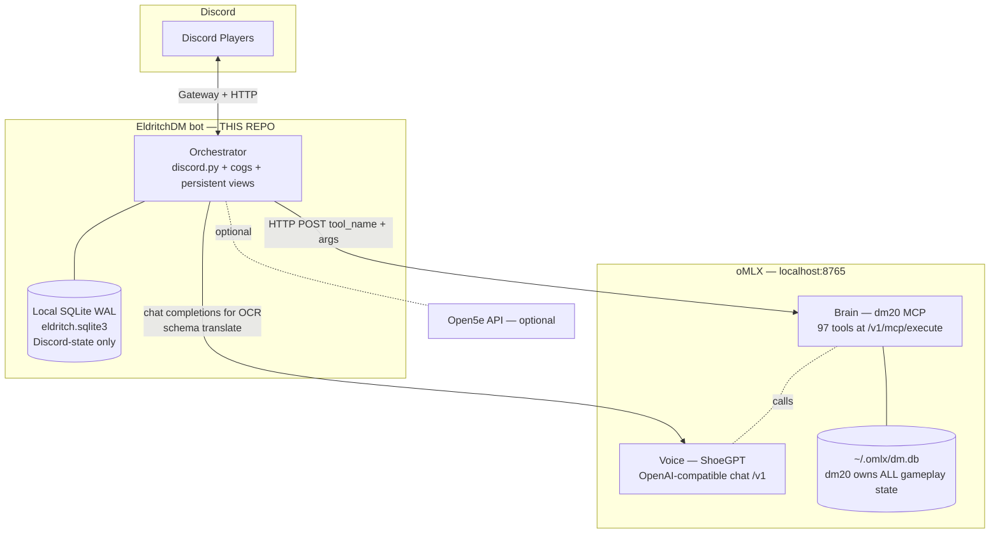

<!-- generated-by: gsd-doc-writer -->
# EldritchDM Architecture

## System Overview

EldritchDM is a local-first, self-hostable **Discord adapter** that exposes the
`dm20` MCP server (a D&D 5e DM toolkit) through Discord. It is NOT a DM engine;
it is the Discord skin on top of one that already exists. The bot runs a
Python 3.11+ `discord.py` 2.7.1 process that turns Discord channel events into
MCP tool calls against an oMLX server, and renders the structured replies back
into embeds, persistent buttons, and modal flows. The architectural style is
**event-driven request orchestration**: Discord interactions and a per-channel
poll loop fire `asyncio` tasks that mutate state in two stores (dm20's gameplay
DB and a small local Discord-state SQLite), then refresh Discord UI via a
rate-limit-aware embed coalescer.

The defining integrity rule: **the bot never computes game math.** All dice,
HP, AC, conditions, initiative, and rules adjudication are deterministic
Python inside the `dm20` MCP server. The bot's only job is to enforce Discord
identity (turn gatekeeping by Discord user_id), provide the timed reactive UI
(Riposte) that `dm20` does not natively model, ingest non-D&D-Beyond character
sheets via OCR/PDF, and translate dm20 responses into Discord embeds.

## The Three-Brain Hybrid

EldritchDM splits the DM job across three processes with a hard responsibility
boundary between narration (LLM), rules (Python), and presentation (Discord):



- **Voice — oMLX / ShoeGPT.** An OpenAI-compatible chat endpoint at
  `http://localhost:8765/v1` running the `ShoeGPT` model (Gemma 4 4-bit). The
  bot calls it directly only for **character-sheet schema translation** during
  ingest (`src/eldritch_dm/ingest/translate.py`, `response_format=json_object`,
  `temp=0.05`). All in-game narration is generated by `dm20`'s Claudmaster loop
  internally; the bot never prompts the LLM with game state.

- **Brain — `dm20` MCP server.** The full D&D rules engine, exposed by oMLX at
  `http://localhost:8765/v1/mcp/execute` (per-call `{tool_name, arguments}`
  payload). dm20 owns campaigns, characters, multiclass/level-up, combat
  (`start_combat` / `next_turn` / `combat_action`), encounters, rulebook
  indexing, the Claudmaster autonomous-DM loop, Party Mode HTTP/WS multiplayer
  queue, D&D Beyond import, and prebuilt adventures. **Its database lives at
  `~/.omlx/dm.db` and this repo never touches it.**

- **Orchestrator — THIS REPO.** A `discord.py` 2.7.1 bot
  (`src/eldritch_dm/bot/bot.py:EldritchBot`) that binds Discord channels to
  dm20 campaigns/Party Mode sessions, owns Discord-specific state (channel ↔
  campaign mapping, persistent View `custom_id`s, riposte deadlines, sanitizer
  audit), provides the timed reactive UI, enforces turn gatekeeping by Discord
  `user_id`, and ingests OCR/PDF character sheets.

The boundary is enforced in code: see `.planning/PROJECT.md` "Out of Scope"
(no own combat/dice/rules engine, no own SQLite schema for characters /
sessions / monsters / memory, no own campaign memory), and the
`combat_conditions` table comment in `database/schema.sql` (dodge is shimmed
locally only because dm20 has no built-in "dodging" condition — see Phase 4
`04-RESEARCH.md` Q2).

## Module Layout (`src/eldritch_dm/`)

```
src/eldritch_dm/
├── config.py                  ── pydantic-settings env loader
├── logging.py                 ── structlog JSON/console + secret scrubbing
├── mcp/                       ── async MCP client + typed tool wrappers
├── persistence/               ── aiosqlite, WAL, single-writer queue, repos
├── safety/                    ── player-input sanitizer + audit
├── gameplay/                  ── orchestration: Party Mode loop, batching, gatekeeper
├── ingest/                    ── OCR/PDF/translate pipeline
├── bot/                       ── discord.py integration layer (cogs, views, embeds)
└── lint/                      ── EDM001 defer-discipline AST checker
```

**`config.py`** loads every environment variable via `pydantic-settings`
(`Settings` is `frozen=True`, accessed via `get_settings()` `lru_cache`). It
defines the oMLX endpoint, MCP execute URL, DB path, log level, gameplay
knobs (riposte TTL, embed edit rate limit, modal char cap, batch window) and
the dm20 Party Mode port. It MUST NOT import `mcp`, `persistence`, or `safety`
(import-linter contract — see "Layering Rules" below).

**`logging.py`** configures `structlog` once at startup with either a JSON
renderer (production) or `ConsoleRenderer` (dev). A `_scrub_secrets` processor
redacts any event-dict key containing `token`, `secret`, `key`, `password`,
`passwd`, or `auth`. All other modules use `get_logger(__name__).bind(...)`
to attach `channel_id`, `campaign_name`, `session_id`, `tool_name`, etc.

**`mcp/`** (`__init__.py` exports `MCPClient`, the `MCPError` hierarchy,
`HealthCheck`, `CircuitBreaker`) is the async client to dm20. `client.py`
wraps `httpx.AsyncClient` (HTTP/2 by default, `Timeout(connect=2s, read=30s,
write=5s)`) with `tenacity` retry (3 attempts, exponential backoff 0.5s/1s/2s,
retry only on `httpx.TimeoutException`, `httpx.NetworkError`, and 5xx — 4xx
surfaces immediately as `MCPToolError`). `health.py` provides a two-state
breaker (CLOSED/OPEN, no HALF_OPEN — recovery is immediate on the first
success after recovery, see Phase 1 decision D-08) plus a `HealthCheck`
loop that pings `{endpoint}/models` on a 60s interval (configurable) and
updates the breaker. `rate_limit.py` is the `ChannelRateLimiter` — a
per-channel token bucket (min interval 200ms by default) for mutating MCP
calls (OPS-03). `tools.py` is the typed wrapper layer: one Python function
per dm20 tool we use, all returning `dict[str, Any]` in v1, with the
`TOOL_TO_FUNCTION` map as the single source of truth.

**`persistence/`** is the local Discord-state layer. `connection.py` exposes
`apply_pragmas` (foreign_keys=ON, journal_mode=WAL, busy_timeout=5000,
synchronous=NORMAL — applied in that order), `open_connection` (read-only
async context manager), and `WriterQueue` (a single long-lived writer
connection driven by an `asyncio.Queue`, all writes use `BEGIN IMMEDIATE`).
`bootstrap.py` applies `database/schema.sql` idempotently and logs the
schema sha256 on every run. `models.py` defines frozen pydantic v2 row
shapes (`ChannelSession`, `PersistentView`, `RiposteTimer`,
`SanitizerAuditRow`) plus the `ChannelState` and `RiposteStatus` enums.
Repositories (`channel_sessions_repo.py`, `persistent_views_repo.py`,
`riposte_timers_repo.py`, `sanitizer_audit_repo.py`,
`combat_conditions_repo.py`) provide async CRUD via the WriterQueue.
`locks.py` is `SessionLocks`, a lazily-populated registry of per-channel
`asyncio.Lock` instances. `checkpoint.py` runs `PRAGMA wal_checkpoint(TRUNCATE)`
on a configurable interval, skipping when the WriterQueue has pending writes.

**`safety/`** is the player-input sanitizer (`sanitizer.py`). The flow is
strictly ordered (D-24): truncate to `max_chars` first (prevents past-cap
sentinel smuggling), strip a default blacklist of ChatML/control tokens
(`<tool_call>`, `<|im_start|>`, `SYSTEM:`, `<player_action>`, `<|endoftext|>`,
etc.), apply a broad `<\|.*?\|>` regex catch-all, then wrap the result in
`<player_action speaker="..." user_id="...">…</player_action>` with
XML-escaped attributes. An audit row is written to `sanitizer_audit` only
when stripping or truncation actually occurred. Imports of `eldritch_dm.mcp`
and of any persistence submodule other than `models` are forbidden.

**`gameplay/`** is the orchestration layer added in Phase 4. `party_mode.py`
is the `PartyModeOrchestrator` — one `asyncio.Task` per active
EXPLORATION/COMBAT channel that drives the dm20 pop/think/prefetch/resolve
loop at 250ms cadence. `exploration_batch.py` is `BatchCoordinator` +
`ExplorationBatch`, the 30s action-batching window for multi-player
exploration (EXPLORE-06). `game_state_parser.py` is a regex parser for dm20's
markdown `get_game_state` response (dm20 returns formatted text, NOT JSON —
see Phase 4 `04-RESEARCH.md` Q5). `turn_gatekeeper.py` is a pure-stdlib helper
that compares a Discord `interaction.user.id` against the current actor's
`player_id` field on an enriched game-state dict.

**`ingest/`** is the OCR/PDF → schema translation pipeline (`pipeline.py:
ingest`). Magic-byte sniffing routes attachments to either OCR (`ocr.py`:
`ocrmac` primary on macOS, `easyocr` fallback) or PDF text extraction
(`pdf.py`: `PyMuPDF` primary, `pypdf` fallback). All heavy work runs through
`executor.py` (`ThreadPoolExecutor(max_workers=2)`) via `run_in_executor`.
Extracted text is passed to oMLX for schema translation
(`translate.py:translate_to_character_sheet`), validated against
`schema.py:CharacterSheet` (pydantic v2), then verified against dm20's
`get_class_info` / `get_race_info` for confidence scoring (D-26: 0.3 OCR,
0.3 pydantic clean, 0.2 class verified, 0.2 race verified, max 1.0).

**`bot/`** is the integration layer (`__init__.py` exports `EldritchBot`).
`bot.py:EldritchBot` subclasses `commands.Bot`, sets `intents.message_content
= False` (D-04 security — bot never reads raw messages), and constructs all
subsystem handles in `__init__` but defers all I/O to `setup_hook`.
`setup_hook.py` registers DynamicItem classes, rehydrates active sessions
from `channel_sessions`, calls `bot.add_view(view, message_id=...)` for each
`persistent_views` row, and starts orchestrators for any
EXPLORATION/COMBAT-state channels. `dynamic_items.py` defines persistent
button classes — each subclasses `discord.ui.DynamicItem[discord.ui.Button]`
with a class-level regex `template` (e.g., `ReadyButton`'s
`^ready:(?P<channel_id>\d+)$`, `EndTurnButton`'s
`endturn:(?P<channel_id>\d+):(?P<actor>\d+)`, `AttackButton`'s
`attack:(?P<channel_id>\d+):(?P<actor_id>\d+):(?P<round>\d+)` where `round`
acts as a stale-click cache-buster). `coalescer.py` is `EmbedCoalescer` plus
`ChannelEditBudget` — together they implement ≤1 edit/sec/message plus
≤5 edits/5s/channel (Discord's documented per-channel budget). `embeds.py`
holds pure renderers: `lobby_embed`, `room_embed`, `combat_embed`,
`character_confirm_embed` (no I/O, no async — testable). `cogs/` contains
`DiagnosticsCog` (`/ping`, `/status`), `LobbyCog` (`/start_game`,
`/load_adventure`), `IngestCog` (`/upload_character_url`,
`/upload_character_file`, `/upload_character_manual`), `ExplorationCog`
(declare-action modal + room embed lifecycle), and `CombatCog` (combat embed
lifecycle, turn-gated action buttons, EXPLORATION ↔ COMBAT transition).
`modals.py`, `permissions.py`, `qr.py` (segno-based party-mode QR rendering),
`warnings.py` (ephemeral warning helper), and `party_mode_parser.py` are
supporting modules.

**`lint/`** contains `edm001.py`, an AST checker that enforces every Discord
interaction callback's first non-docstring statement be
`await <interaction>.response.defer(...)` (or `send_modal(...)` for direct
modal returns). Exceptions are silenced with `# noqa: EDM001 — <reason>` on
the function `def` line. Wired into `.pre-commit-config.yaml` and CI.

## Data Model — Local SQLite

The bot's persistent state lives in `eldritch.sqlite3` (path configurable via
`ELDRITCH_DB_PATH`, default `./eldritch.sqlite3`). The DDL is in
`database/schema.sql` and is applied idempotently by
`python -m eldritch_dm.persistence.bootstrap`. **All gameplay state — characters,
sessions, monsters, memory — lives in dm20's `~/.omlx/dm.db` and is never
touched by this repo.**

Five tables:

1. **`channel_sessions`** (PK `channel_id`) — maps a Discord channel to a
   dm20 campaign + Claudmaster session + Party Mode token, and tracks the
   high-level state (`LOBBY`, `EXPLORATION`, `COMBAT_INIT`, `COMBAT`,
   `NPC_DLG`, `PAUSED`). `created_at` / `updated_at` timestamps.
2. **`persistent_views`** (PK `custom_id`) — registry of every persistent
   button currently live on a Discord message. `view_class`, `message_id`,
   `channel_id`, and a free-form `payload_json`. Cascade-deletes when its
   `channel_session` is removed. Note: as commented in `dynamic_items.py`,
   this table is bookkeeping / audit metadata — `bot.add_dynamic_items(Cls)`
   is what actually routes clicks. The table also helps recover live messages
   on restart and ensures `bot.add_view(view, message_id=...)` re-registers
   the view (audit layer).
3. **`riposte_timers`** (PK autoincrement `id`) — deadline rows that drive
   the 8-second reactive Riposte button. Includes the Discord `user_id` for
   gatekeeping, the missing `monster_uuid`, `weapon_used`, `message_id`,
   `custom_id`, `deadline_ts`, and a `status` enum (`pending`, `consumed`,
   `expired`, `cancelled`). A partial index
   `idx_riposte_pending_deadline ON (status, deadline_ts) WHERE
   status='pending'` makes the sweeper query cheap.
4. **`sanitizer_audit`** (PK autoincrement `id`) — append-only audit log of
   every modal input where the sanitizer either stripped a token or
   truncated. Stores `raw_input`, the JSON list of `stripped_tokens`, the
   `redacted_output`, and a `truncated` flag.
5. **`combat_conditions`** (PK autoincrement `id`) — Phase 4 addition: local
   tracking of dm20-shimmed conditions, currently only `dodging` (Phase 4
   `04-RESEARCH.md` Q2: dm20 has 14 SRD conditions, "dodging" is not one of
   them). `expires_round` is cleared at the start of the dodger's next turn.
   v1 dodge is narrative-only — the LLM is told "X is dodging" but
   `combat_action` does not (yet) reduce attacker to-hit; Phase 5 will wire
   disadvantage when dm20 supports it.

All connections apply `PRAGMA foreign_keys = ON` and `journal_mode = WAL` at
open time; `busy_timeout=5000`; `synchronous=NORMAL`.

## Concurrency Model

Three layered primitives keep concurrent Discord events safe across a single
async event loop and a single SQLite writer:

1. **WAL + single async writer queue.** Every write goes through
   `persistence.connection.WriterQueue`, which owns one long-lived
   `aiosqlite.Connection` and serializes writes via an `asyncio.Queue`. Each
   write uses `BEGIN IMMEDIATE` (D-17) — never a bare transaction — with no
   `await` between `BEGIN IMMEDIATE` and `COMMIT` except the caller's
   payload. Concurrent readers are allowed by WAL via `open_connection`.

2. **Per-channel `asyncio.Lock` (`SessionLocks`).** Created lazily on first
   `.get(channel_id)`; never evicted (cardinality bounded by active Discord
   channels). Wraps any sequence of MCP calls that mutates dm20 state
   (`combat_action`, `next_turn`, batch resolution) to prevent two concurrent
   button clicks on the same channel from clobbering each other (MCP-07).

3. **`ChannelRateLimiter` (`mcp.rate_limit`).** Per-channel token bucket;
   one token per `mcp_rate_limit_ms` (default 200ms) for **mutating** MCP
   calls (OPS-03). `acquire()` never raises — it awaits the bucket drain.
   Read calls (`party_pop_action`, `get_game_state`) bypass the limiter.

For Discord-side rate-limiting, `bot.coalescer.ChannelEditBudget` enforces
Discord's documented per-channel limit of 5 edits per 5 seconds, shared
across all `EmbedCoalescer` instances on the same channel. Each coalescer
keeps a latest-value slot and an `asyncio.Event` so that bursts of state
changes collapse into at most one edit per second per message (D-28,
Phase 2 RESEARCH Pattern 4).

The `PartyModeOrchestrator` (gameplay/party_mode.py) is one `asyncio.Task`
per active EXPLORATION/COMBAT channel. It polls `dm20__party_pop_action` at
`party_poll_interval_ms` (default 250ms, configurable), and every
`_COMBAT_CHECK_EVERY_N_POLLS = 4` ticks (~1Hz) also calls `get_game_state`
to detect EXPLORATION ↔ COMBAT transitions, which fire an
`on_state_change` callback.

## External Boundaries

| Surface | Endpoint / Library | Purpose | Owner |
|---|---|---|---|
| oMLX OpenAI-compat chat | `POST http://localhost:8765/v1/chat/completions` | Character-sheet schema translation only (ingest) | oMLX (`com.user.omlx` launchd) |
| oMLX MCP execute | `POST http://localhost:8765/v1/mcp/execute` (body `{tool_name, arguments}`) | All gameplay tool calls — `MCPClient` posts here | dm20 (mounted in oMLX) |
| oMLX MCP tools list | `GET http://localhost:8765/v1/mcp/tools` | Capability discovery / drift detection | dm20 (mounted in oMLX) |
| oMLX models | `GET http://localhost:8765/v1/models` | Health-check ping (60s interval) → CircuitBreaker | oMLX |
| Discord Gateway + HTTP | `discord.py` v2.7.1 (`commands.Bot`) | Slash commands, interactions, message edits | Discord |
| Open5e | `https://api.open5e.com/` (optional, mentioned in project constraints) | SRD lookup fallback if needed | Open5e <!-- VERIFY: bot does not call Open5e in v1; all SRD lookups go via dm20 — Open5e remains noted in PROJECT.md constraints but no client code references it in src/eldritch_dm/ -->|
| dm20 Party Mode HTTP/WS | `localhost:{PARTY_MODE_PORT}` (default 8080) | Started by `dm20__start_party_mode`; party-mode invite/QR posted to lobby | dm20 |

The `MCPClient` is the sole HTTP path to gameplay. The bot **does not** talk
to oMLX's chat completions endpoint for game narration — that path is
internal to dm20's Claudmaster.

## Restart-Survival Contract

Bot restart is a tested first-class scenario (Phase 2 success criterion 5,
OPS-01). The contract:

1. **DynamicItem custom_ids carry all routing state.** Each persistent button
   class has a regex `template` and the live button's `custom_id` encodes
   `channel_id`, actor `user_id`, and (for combat buttons) `round` —
   stale clicks after round advance are rejected by the cog. Because
   `bot.add_dynamic_items(*DYNAMIC_ITEM_CLASSES)` is called in
   `setup_hook`, every matching click after restart routes to its handler
   without any per-message registration.
2. **`persistent_views` rehydration.** `setup_hook` reads every active
   `channel_sessions` row, then for each `persistent_views` row builds an
   appropriate `View` and calls `bot.add_view(view, message_id=...)` — this
   is an audit/cleanup layer (D-24 step 5). The primary dispatch mechanism
   is the DynamicItem regex routing.
3. **`riposte_timers` sweeper (Phase 5).** Rows with `status='pending'` and
   `deadline_ts` in the past are auto-cleaned on restart; rows still inside
   their window remain clickable. The partial index on
   `(status, deadline_ts) WHERE status='pending'` makes the sweep cheap.
4. **Orchestrator restart.** Every channel session whose `state` is
   `EXPLORATION` or `COMBAT` gets a fresh `PartyModeOrchestrator` task in
   `setup_hook`. The orchestrator immediately re-polls `get_game_state` and
   resumes the loop where it left off (no in-process state to recover).
5. **MCP client / CircuitBreaker** is reconstructed at startup; the
   `HealthCheck` loop restarts at its 60s cadence and the breaker begins
   `CLOSED`.
6. **Graceful shutdown (OPS-04)** cancels pending tasks, flushes the
   sanitizer audit, and closes the writer connection with a final
   `wal_checkpoint(TRUNCATE)` (`CheckpointTask.stop(final=True)`).

## Layering Rules (import-linter contracts)

Module boundaries are enforced by import-linter (configured in
`pyproject.toml` under `[tool.importlinter]`). Violations fail CI. The
contracts:

| Contract | Source | Forbidden imports |
|---|---|---|
| persistence must not import mcp or safety | `eldritch_dm.persistence` | `eldritch_dm.mcp`, `eldritch_dm.safety` |
| mcp must not import persistence or safety | `eldritch_dm.mcp` | `eldritch_dm.persistence`, `eldritch_dm.safety` |
| safety must not import mcp or persistence internals | `eldritch_dm.safety` | `eldritch_dm.mcp` + all persistence submodules **except `persistence.models`** (relaxation: safety needs `SanitizerAuditRow`) |
| config and logging must not import subsystems | `eldritch_dm.config`, `eldritch_dm.logging` | `eldritch_dm.mcp`, `eldritch_dm.persistence`, `eldritch_dm.safety` |
| ingest must not import bot or persistence internals | `eldritch_dm.ingest` | `eldritch_dm.bot` + all persistence submodules except `models` |
| nothing outside bot may import from bot | `config`, `logging`, `mcp`, `persistence`, `safety`, `gameplay` | `eldritch_dm.bot` |
| gameplay must not import bot or ingest | `eldritch_dm.gameplay` | `eldritch_dm.bot`, `eldritch_dm.ingest` |

The net effect: `bot/` is the only integration point that imports from
everything; the subsystems below it (`mcp`, `persistence`, `safety`,
`gameplay`, `ingest`) are hermetic and testable without Discord. **Notably,
`mcp → ingest` is forbidden** (mcp is a pure transport-and-types layer,
ingest is a higher-level pipeline). The single intentional relaxation is
`safety → persistence.models` (pure pydantic shapes, no SQL behavior) and
`ingest → mcp.client + mcp.tools` (ingest must verify class/race against
dm20).

## Directory Structure Rationale

```
DiscordDM/
├── src/eldritch_dm/          ── package source (see Module Layout above)
├── tests/                    ── pytest suite, organised parallel to src/
├── database/schema.sql       ── single source of truth for local SQLite DDL
├── .planning/                ── GSD planning artifacts (PROJECT, REQUIREMENTS,
│                                ROADMAP, per-phase plans + research)
├── tools/                    ── developer tooling (e.g. gen_mcp_wrappers.py
│                                drift detection)
├── pyproject.toml            ── dependencies + ruff + pytest + import-linter
├── install.sh                ── self-host bootstrap script
└── run.py                    ── entrypoint: validate env, ping oMLX, launch bot
                                <!-- VERIFY: run.py existence at project root —
                                referenced in HOST-04 but not confirmed by listing -->
```

The `src/eldritch_dm/` package layout intentionally mirrors the import-linter
firewall: each subdirectory is its own contract source, and a flat module
inside `bot/` (`cogs/`, `dynamic_items.py`, `embeds.py`, `modals.py`,
`coalescer.py`, `permissions.py`, `qr.py`, `warnings.py`,
`party_mode_parser.py`, `setup_hook.py`) keeps every Discord-coupled
concern co-located. The two top-level files at the package root (`config.py`,
`logging.py`) are intentionally tiny and depend on nothing else inside the
package so they can be imported by any subsystem without creating a cycle.

---

*This document describes the architecture as of Phase 4 Plan 02 (complete).
Phase 5 will add the timed Riposte reactive UI, the `riposte_timers` sweeper
background task, and full self-host polish.*
