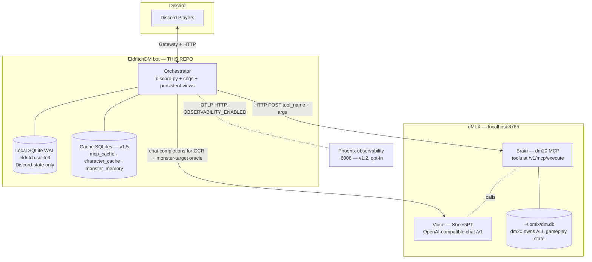

<!-- generated-by: gsd-doc-writer -->
# EldritchDM Architecture

## System Overview

EldritchDM is a local-first, self-hostable **Discord adapter** that exposes
the `dm20` MCP server (a D&D 5e DM toolkit) through Discord. It is NOT a DM
engine; it is the Discord skin on top of one that already exists. The bot
runs a Python 3.11+ `discord.py` 2.7.1 process that turns Discord channel
events into MCP tool calls against an oMLX server, and renders the
structured replies back into embeds, persistent buttons, and modal flows.
The architectural style is **event-driven request orchestration**: Discord
interactions and a per-channel poll loop fire `asyncio` tasks that mutate
state in two stores (dm20's gameplay DB and a small local Discord-state
SQLite), then refresh Discord UI via a rate-limit-aware embed coalescer.

The defining integrity rule: **the bot never computes game math.** All
dice, HP, AC, conditions, initiative, and rules adjudication are
deterministic Python inside the `dm20` MCP server. The bot's only job is
to enforce Discord identity (turn gatekeeping by Discord user_id), provide
the timed reactive UI (Riposte) that `dm20` does not natively model,
ingest non-D&D-Beyond character sheets via OCR/PDF, observe and report on
the system's own behavior (Phase 11 OTel + Phase 13 KPIs/cost), and
translate dm20 responses into Discord embeds.

The architecture has grown across 11 milestones (v1.0 → v1.11; see
[`CHANGELOG.md`](../CHANGELOG.md)) but the layering rules below are
unchanged from v1.0 — every addition has been a new hermetic subsystem
under the same import-linter firewall.

## The Three-Brain Hybrid

EldritchDM splits the DM job across three processes with a hard
responsibility boundary between narration (LLM), rules (Python), and
presentation (Discord):



- **Voice — oMLX / ShoeGPT.** An OpenAI-compatible chat endpoint at
  `http://localhost:8765/v1` running the `ShoeGPT` model (Gemma 4 4-bit).
  The bot calls it directly for **character-sheet schema translation**
  during ingest (`src/eldritch_dm/ingest/translate.py`,
  `response_format=json_object`, `temp=0.05`), and — since v1.1 — for
  **SmartMonsterDriver targeting decisions**
  (`src/eldritch_dm/gameplay/smart_monster_driver.py`, 1500ms hard
  timeout, structured-output fallback). dm20 still owns in-game narration
  internally; the bot never prompts the LLM with HP/AC/round state.

- **Brain — `dm20` MCP server.** The full D&D rules engine, exposed by
  oMLX at `http://localhost:8765/v1/mcp/execute` (per-call
  `{tool_name, arguments}` payload). dm20 owns campaigns, characters,
  multiclass/level-up, combat (`start_combat` / `next_turn` /
  `combat_action`), encounters, rulebook indexing, the Claudmaster
  autonomous-DM loop, Party Mode HTTP/WS multiplayer queue, D&D Beyond
  import, and prebuilt adventures. **Its database lives at
  `~/.omlx/dm.db` and this repo never touches it.**

- **Orchestrator — THIS REPO.** A `discord.py` 2.7.1 bot
  (`src/eldritch_dm/bot/bot.py:EldritchBot`) that binds Discord channels
  to dm20 campaigns/Party Mode sessions, owns Discord-specific state
  (channel ↔ campaign mapping, persistent View `custom_id`s, riposte
  deadlines, sanitizer audit), provides the timed reactive UI, enforces
  turn gatekeeping by Discord `user_id`, ingests OCR/PDF character
  sheets, and (v1.2+) emits OpenTelemetry spans + KPIs + cost reports
  for the operator.

## Module Layout (`src/eldritch_dm/`)

```
src/eldritch_dm/
├── bootstrap.py              ── 3-stage preflight (env / oMLX / SQLite)
├── logging.py                ── structlog JSON/console + secret scrubbing
├── config/                   ── pydantic-settings env loader
├── mcp/                      ── async MCP client + cache + typed tool wrappers
├── persistence/              ── aiosqlite, WAL, single-writer queue, repos, char cache
├── safety/                   ── player-input sanitizer + audit + injection corpus
├── gameplay/                 ── orchestration: Party Mode loop, batching, gatekeeper,
│                                Smart MonsterDriver, AOE/multi-target, monster memory
├── ingest/                   ── OCR/PDF/translate pipeline
├── observability/            ── Phase 11+13: OTel tracer, instrumentation,
│                                KPIs, alerts, span buffer, cost, narration cache,
│                                degraded mode, /metrics endpoint, owner DM
├── eval/                     ── Phase 12: LLM-as-judge tactical scoring CLI
├── tools/                    ── operator CLIs (backfill, cost-report, cache-*, perf)
├── bot/                      ── discord.py integration (cogs, views, embeds, modals)
└── lint/                     ── EDM001 defer-discipline AST checker
```

`config/__init__.py` and `bot/__init__.py` are package roots; `config.py`
and `bot.py` no longer exist as flat modules (refactored to packages
during the v1.0 → v1.1 transition).

### Layer details

**`config/`** loads every environment variable via `pydantic-settings`
(`Settings` is `frozen=True`, accessed via `get_settings()` `lru_cache`).
It defines the oMLX endpoint, ingest backend selection (D-27 — `omlx`
default, `ollama` and `openrouter` alternatives), MCP execute URL, DB
path, log level, gameplay knobs, cache toggles (Phase 16/17/18), monster
driver mode, streaming embed gate, and the dm20 Party Mode port. It MUST
NOT import `mcp`, `persistence`, or `safety` (import-linter enforced —
see "Layering Rules" below). `config/token_guard.py` (v1.1 / TD-1) is the
shared helper that makes `run.py` and `python -m eldritch_dm.bot`
parity-identical on missing-token error handling.

**`logging.py`** configures `structlog` once at startup with either a
JSON renderer (production) or `ConsoleRenderer` (dev). A `_scrub_secrets`
processor redacts any event-dict key containing `token`, `secret`, `key`,
`password`, `passwd`, or `auth`. All other modules use
`get_logger(__name__).bind(...)` to attach `channel_id`, `campaign_name`,
`session_id`, `tool_name`, etc.

**`mcp/`** is the async client to dm20. `client.py` wraps
`httpx.AsyncClient` (HTTP/2 by default) with `tenacity` retry (3 attempts,
exponential backoff, retry only on `httpx.TimeoutException`,
`httpx.NetworkError`, and 5xx — 4xx surfaces immediately as
`MCPToolError`). `health.py` provides a two-state breaker (CLOSED/OPEN,
no HALF_OPEN — recovery is immediate on first success after recovery)
plus a `HealthCheck` loop. `rate_limit.py` is the `ChannelRateLimiter` —
a per-channel token bucket (min interval 200ms by default) for mutating
MCP calls (OPS-03). `tools.py` is the typed wrapper layer: one Python
function per dm20 tool with the `TOOL_TO_FUNCTION` map as the single
source of truth. `errors.py` defines the `MCPError` hierarchy.
**`cache.py`** (Phase 16 / v1.5) wraps `MCPClient` composition-style:
L1 in-process `OrderedDict` LRU + opt-in L2 `aiosqlite` WAL store, both
keyed by SHA-256 of canonical JSON args (stable across `PYTHONHASHSEED`).
Fail-CLOSED allow-list — only truly-static reference tools are cacheable;
mutations and mutable-state reads (`get_character`, `get_game_state`,
…) are excluded by design (D-117).

**`persistence/`** is the local Discord-state layer. `connection.py`
exposes `apply_pragmas` (foreign_keys=ON, journal_mode=WAL,
busy_timeout=5000, synchronous=NORMAL — applied in that order),
`open_connection` (read-only async context manager), and `WriterQueue`
(a single long-lived writer connection driven by an `asyncio.Queue`, all
writes use `BEGIN IMMEDIATE`). `bootstrap.py` applies
`database/schema.sql` idempotently. `models.py` defines frozen pydantic
v2 row shapes (`ChannelSession`, `PersistentView`, `RiposteTimer`,
`SanitizerAuditRow`, …). Repositories provide async CRUD via the
WriterQueue: `channel_sessions_repo.py`, `persistent_views_repo.py`,
`riposte_timers_repo.py`, `sanitizer_audit_repo.py`,
`combat_conditions_repo.py`, `pc_classes_repo.py` (v1.1 / Phase 9 — PC
class lookup for Riposte eligibility), `monster_memory_repo.py` (v1.6 /
Phase 21 — opt-in monster-memory snapshots when
`MONSTER_MEMORY_PERSIST=true`). **`character_cache.py`** (v1.5 / Phase 17)
is a standalone aiosqlite WAL cache for static-only character snapshots
at `~/.eldritch/character_cache.sqlite` (separate DB from
`eldritch.sqlite3`; not routed through the main `WriterQueue`).
`locks.py` is `SessionLocks`, a lazily-populated registry of per-channel
`asyncio.Lock`. `checkpoint.py` runs `PRAGMA wal_checkpoint(TRUNCATE)`
on a configurable interval.

**`safety/`** is the player-input sanitizer (`sanitizer.py`). The flow
is strictly ordered (D-24): truncate to `max_chars` first, strip a
default blacklist of ChatML/control tokens, apply a broad regex
catch-all, then wrap in `<player_action speaker="..." user_id="...">…</player_action>`
with XML-escaped attributes. An audit row is written only when stripping
or truncation actually occurred. The `corpus/injection_cases.yaml`
adversarial corpus drives the parametrized sanitizer tests (≥ 30 cases).

**`gameplay/`** is the orchestration layer. `party_mode.py` is the
`PartyModeOrchestrator` — one `asyncio.Task` per active
EXPLORATION/COMBAT channel that drives the dm20 pop/think/prefetch/resolve
loop at 250ms cadence. `exploration_batch.py` is `BatchCoordinator` + the
30s action-batching window. `game_state_parser.py` regex-parses dm20's
markdown `get_game_state` response. `turn_gatekeeper.py` compares
`interaction.user.id` against the current actor's `player_id`.
`reactions.py` owns the Phase 5 Riposte reactive UI;
`riposte_sweeper.py` is the background expiry sweeper.
**`smart_monster_driver.py`** (v1.1+ / Phase 10) is the LLM-routed
monster targeter: INT-gated (≤4 random, ≥8 LLM, 5-7 mixed with
deterministic seed), 1500ms hard timeout, pydantic post-parse validation
rejects hallucinated `target_pc_ids`, per-round FIFO cache, AOE/multi-
target tactic selection (v1.6 — `target_pc_ids` + `tactic_kind` Literal).
**`monster_driver_factory.py`** constructs the driver based on
`MONSTER_DRIVER` (smart / random / mixed). **`monster_memory.py`** (v1.6
/ Phase 21) is the cross-round in-memory tactical signal store:
`damage_dealt_by` (categorical bands), `concentrating_on`, INT-gated
`marked_dangerous` set. Optionally persisted via
`MONSTER_MEMORY_PERSIST=true`. **`eligibility_loader.py`** (v1.1 /
Phase 8) loads the Riposte eligibility YAML through the 3-tier walk
(`ELDRITCH_ELIGIBILITY_YAML` → `~/.eldritch/eligibility.yaml` →
`database/eligibility.yaml`), with 60s mtime hot-reload (v1.6).
`normalize.py` + `combat_outcome_parser.py` are pure-Python parsers for
dm20 response shapes.

**`ingest/`** is the OCR/PDF → schema translation pipeline
(`pipeline.py:ingest`). Magic-byte sniffing routes attachments to either
OCR (`ocr.py`: `ocrmac` primary on macOS, `easyocr` fallback) or PDF
text extraction (`pdf.py`: `PyMuPDF` primary, `pypdf` fallback). All
heavy work runs through `executor.py`
(`ThreadPoolExecutor(max_workers=2)`). Extracted text is passed to the
ingest backend for schema translation
(`translate.py:translate_to_character_sheet` — backend resolved by
`Settings.resolve_ingest_config()`; D-27), validated against
`schema.py:CharacterSheet` (pydantic v2), then verified against dm20's
`get_class_info` / `get_race_info` for confidence scoring.

**`observability/`** (v1.2+, Phase 11 + Phase 13) is the operator
telemetry surface. Lazy-imports OTel — when `OBSERVABILITY_ENABLED=false`
(the default), nothing in this package costs anything at cold start.

- `tracer.py` — reads `OBSERVABILITY_ENABLED` and
  `OTEL_EXPORTER_OTLP_ENDPOINT`; wires the `TracerProvider` +
  `OTLPSpanExporter`.
- `instrumentation.py` — `traced_decision` (SmartMonsterDriver outer
  span) and `traced_translate` (ingest) context managers with the D-65
  8-attribute span schema (`monster.id`, `channel.id`, `combat.round`,
  `driver.path`, `latency_ms`, `tokens.input`, `tokens.output`,
  `fallback.reason`).
- `span_buffer.py` — local rolling buffer of decision spans for offline
  analysis (`ELDRITCH_SPAN_BUFFER_PATH` for persistence).
- `kpi.py` + `alerts_loader.py` + `alert_evaluator.py` — 5 live KPI
  monitors driven by `database/alerts.yaml` (3-tier thresholds: warn /
  page / critical).
- `metrics_endpoint.py` — opt-in Prometheus `/metrics` (Phase 13 /
  MON-01) on `OBSERVABILITY_METRICS_BIND:OBSERVABILITY_METRICS_PORT`.
- `cost.py` + `budget_dm.py` + `budget_guard.py` — token/USD cost
  tracking against `database/pricing.yaml` (v1.2.1-verified values).
  When the daily cap (`ELDRITCH_DAILY_LLM_BUDGET_USD`, default $5.00) is
  exceeded the bot trips degraded mode and DMs `DISCORD_OWNER_ID`.
- `degraded_mode.py` — auto-trips the bot from SmartMonsterDriver back
  to the v1.0 random driver with hysteresis, without ever touching HP/AC
  math. The mechanical-honesty contract holds in degraded mode.
- `narration_cache.py` + `narrcache_runtime.py` — Phase 18 opt-in
  narration response cache with `NarrCacheGate` (fail-CLOSED regex
  classifier on store AND serve).

**`eval/`** (v1.2+, Phase 12) is the LLM-as-judge tactical-scoring
runner. `TacticalJudge` calls a judge model (versioned prompt via
`judge_prompt.py` with SemVer header) to score SmartMonsterDriver
decisions against the 50-scenario Apache-2.0 corpus
(`eval/dataset/`). `runner.py` orchestrates corpus → judge →
`aggregator.py` → `reporter.py` (JSON + Markdown). `cli.py` exposes the
`eldritch-dm-eval` console script; `--baseline` enables regression
detection with 3-tier exit codes (0 = no regression, 1 = warn, 2 =
critical). The package may import `gameplay` (to invoke
SmartMonsterDriver) and `observability` (for `traced_eval` spans) but
not `bot` or `ingest`.

**`tools/`** is the operator CLI surface. Each is wired through
`[project.scripts]` in `pyproject.toml`:

| Console script | Module | Purpose |
|---|---|---|
| `eldritch-dm-backfill-pc-classes` | `tools.backfill_pc_classes` | v1.0→v1.1 upgrade tool; populates `pc_classes` from existing dm20 characters so Riposte eligibility fires for legacy PCs. `--dry-run` + `--force` + idempotent default. |
| `eldritch-dm-eval` | `eval.cli` | LLM-as-judge tactical scoring (Phase 12). |
| `eldritch-dm-cost-report` | `tools.cost_report` | Daily LLM-spend report from the local span buffer. |
| `eldritch-dm-cache-clear` | `tools.cache_clear` | Purge character / MCP cache entries. |
| `eldritch-dm-cache-disable` | `tools.cache_disable` | Runtime kill-switch for the narration cache. |
| `eldritch-dm-cache-stats` | `tools.cache_stats` | Live cache hit/miss counters. |
| `eldritch-dm-perf-baseline` | `tools.perf_baseline` | Phase 28 / v1.9: profiler + `--baseline` diff (exit codes 0/1/2 = within tolerance / >+10% warn / >+25% critical). |

**`bot/`** is the integration layer. `bot.py:EldritchBot` subclasses
`commands.Bot`, sets `intents.message_content = False` (D-04 security —
bot never reads raw messages), and constructs all subsystem handles in
`__init__` but defers all I/O to `setup_hook`. `setup_hook.py` registers
DynamicItem classes, rehydrates active sessions, calls `add_view(...)`
for persistent views, and starts orchestrators. `dynamic_items.py`
defines persistent button classes (`ReadyButton`, `EndTurnButton`,
`AttackButton`, `DodgeButton`, `CastSpellButton`, `RiposteButton`,
`DeclareActionButton`) — each with a regex `template` encoding routing
state. `coalescer.py` is `EmbedCoalescer` + `ChannelEditBudget`
(≤1 edit/sec/message + ≤5 edits/5s/channel). `embeds.py` holds pure
renderers (no I/O, no async — testable). `cogs/` contains
`DiagnosticsCog` (`/ping`, `/status`), `LobbyCog`, `IngestCog`,
`ExplorationCog`, `CombatCog`. `circuit_decorator.py` is
`@catch_circuit_open` (v1.1 / OPS-02). `dm_offline_debouncer.py` is the
30s-per-channel "DM is offline" warning rate-limiter. `qr.py`, `modals.py`,
`permissions.py`, `warnings.py`, `party_mode_parser.py`, and
`dynamic_items.py` round out the layer.

**`lint/`** contains `edm001.py`, an AST checker that enforces every
Discord interaction callback's first non-docstring statement be
`await <interaction>.response.defer(...)` (or `send_modal(...)`).
Exceptions are silenced with `# noqa: EDM001 — <reason>`. Wired into
`.pre-commit-config.yaml` and CI.

## Data Model — Local SQLite

The bot's persistent state lives in `eldritch.sqlite3` (path configurable
via `ELDRITCH_DB_PATH`, default `./eldritch.sqlite3`). The DDL is in
`database/schema.sql` and is applied idempotently by
`python -m eldritch_dm.bootstrap` (the bootstrap script orchestrates env
+ oMLX + SQLite checks). **All gameplay state lives in dm20's
`~/.omlx/dm.db` and is never touched by this repo.**

The main DB tables (Phase 1 + Phase 4 + Phase 9):

1. **`channel_sessions`** (PK `channel_id`) — maps a Discord channel to
   a dm20 campaign + Claudmaster session + Party Mode token, and tracks
   the high-level state (`LOBBY`, `EXPLORATION`, `COMBAT_INIT`,
   `COMBAT`, `NPC_DLG`, `PAUSED`).
2. **`persistent_views`** (PK `custom_id`) — registry of every persistent
   button live on a Discord message (audit/recovery layer; primary
   dispatch is via `bot.add_dynamic_items(...)` regex routing).
3. **`riposte_timers`** (PK autoinc `id`) — deadline rows for the
   8-second Riposte button; partial index
   `idx_riposte_pending_deadline ON (status, deadline_ts) WHERE
   status='pending'` makes the sweeper cheap.
4. **`sanitizer_audit`** (PK autoinc `id`) — append-only audit of
   sanitizer events.
5. **`combat_conditions`** (PK autoinc `id`) — Phase 4 dm20-shimmed
   conditions (currently `dodging`).
6. **`pc_classes`** (v1.1 / Phase 9) — denormalized PC class lookup so
   Riposte eligibility resolution doesn't round-trip dm20 on every
   reaction window. Populated by the backfill CLI for legacy PCs.

Three **separate** cache SQLites (v1.5+) live OUTSIDE the main DB
(default `~/.eldritch/`):

- `mcp_cache.sqlite` — Phase 16 opt-in L2 MCP query cache
  (`MCPCACHE_L2_ENABLED=true`).
- `character_cache.sqlite` — Phase 17 static-only PC snapshot cache.
- `monster_memory.sqlite` — Phase 21 opt-in monster-memory persistence
  (`MONSTER_MEMORY_PERSIST=true`).

Each cache DB has its own lazy connection. They are NOT routed through
the main `WriterQueue` — that owns `eldritch.sqlite3` only.

All connections apply `PRAGMA foreign_keys = ON` and `journal_mode = WAL`
at open time.

## Concurrency Model

Three layered primitives keep concurrent Discord events safe across a
single async event loop and a single SQLite writer:

1. **WAL + single async writer queue.** Every write to
   `eldritch.sqlite3` goes through `persistence.connection.WriterQueue`,
   which owns one long-lived `aiosqlite.Connection` and serializes
   writes via an `asyncio.Queue`. Each write uses `BEGIN IMMEDIATE`
   (D-17) — never a bare transaction.
2. **Per-channel `asyncio.Lock` (`SessionLocks`).** Wraps any sequence
   of MCP calls that mutates dm20 state to prevent concurrent button
   clicks on the same channel from clobbering each other (MCP-07).
3. **`ChannelRateLimiter` (`mcp.rate_limit`).** Per-channel token
   bucket; one token per `MCP_RATE_LIMIT_MS` (default 200ms) for
   **mutating** MCP calls (OPS-03). Read calls bypass the limiter.

For Discord-side rate-limiting, `bot.coalescer.ChannelEditBudget`
enforces Discord's documented per-channel limit of 5 edits per 5
seconds, shared across all `EmbedCoalescer` instances on the same
channel.

The `PartyModeOrchestrator` polls `dm20__party_pop_action` at
`PARTY_POLL_INTERVAL_MS` (default 250ms), and every
`_COMBAT_CHECK_EVERY_N_POLLS = 4` ticks also calls `get_game_state` to
detect EXPLORATION ↔ COMBAT transitions. v1.8 verified 4-channel
concurrent-session stress passes with no architectural bugs (closes
v1.0's oldest open Blockers/Concerns item).

## External Boundaries

| Surface | Endpoint / Library | Purpose | Owner |
|---|---|---|---|
| oMLX chat | `POST http://localhost:8765/v1/chat/completions` | Character-sheet ingest translation **and** SmartMonsterDriver target oracle (v1.1+) | oMLX (`com.user.omlx` launchd) |
| oMLX MCP execute | `POST http://localhost:8765/v1/mcp/execute` | All gameplay tool calls | dm20 (mounted in oMLX) |
| oMLX MCP tools list | `GET http://localhost:8765/v1/mcp/tools` | Capability discovery / drift detection | dm20 |
| oMLX models | `GET http://localhost:8765/v1/models` | Health-check ping (60s interval) → CircuitBreaker | oMLX |
| Discord Gateway + HTTP | `discord.py` v2.7.1 | Slash commands, interactions, message edits | Discord |
| dm20 Party Mode HTTP/WS | `localhost:{PARTY_MODE_PORT}` (default 8080) | Party-mode invite/QR posted to lobby | dm20 |
| Phoenix OTLP (opt-in) | `http://localhost:6006/v1/traces` (default) | Decision spans + ingest spans when `OBSERVABILITY_ENABLED=true` | Arize Phoenix (docker-compose.observability.yml) |
| Ingest backend (D-27, optional) | `http://localhost:11434/v1` (Ollama) or `https://openrouter.ai/api/v1` | Alternative ingest LLM (NOT for gameplay — dm20 is always at oMLX) | Operator-chosen |

The `MCPClient` (or `MCPCache` wrapping it, v1.5+) is the sole HTTP
path to gameplay. The bot **does not** talk to oMLX's chat completions
endpoint for game narration — that path is internal to dm20's
Claudmaster.

## Restart-Survival Contract

Bot restart is a tested first-class scenario (Phase 2 success criterion
5, OPS-01). The contract:

1. **DynamicItem custom_ids carry all routing state.** Each persistent
   button class has a regex `template` encoding `channel_id`, actor
   `user_id`, and (for combat buttons) `round` — stale clicks after
   round advance are rejected.
2. **`persistent_views` rehydration.** `setup_hook` reads every active
   `channel_sessions` row, then builds an appropriate `View` per
   `persistent_views` row and calls `bot.add_view(view,
   message_id=...)`.
3. **`riposte_timers` sweeper (Phase 5).** Pending rows past their
   `deadline_ts` are auto-cleaned on restart; rows still inside their
   window remain clickable.
4. **Orchestrator restart.** Every channel session in `EXPLORATION` or
   `COMBAT` state gets a fresh `PartyModeOrchestrator` task in
   `setup_hook`.
5. **MCP client + CircuitBreaker** are reconstructed at startup; the
   `HealthCheck` loop restarts at its configured cadence.
6. **Graceful shutdown (OPS-04)** cancels pending tasks, flushes the
   sanitizer audit, and closes the writer connection with a final
   `wal_checkpoint(TRUNCATE)`.
7. **Optional cross-restart persistence** (v1.5+): the character cache
   (Phase 17) ensures the first turn of a re-launched session doesn't
   wait for full dm20 character ingest; the monster-memory persistence
   (Phase 21, opt-in) preserves tactical signal state across restarts
   when `MONSTER_MEMORY_PERSIST=true`.

## Layering Rules (import-linter contracts)

Module boundaries are enforced by import-linter (`pyproject.toml`
`[tool.importlinter]`). Violations fail CI. Current contracts (all
`forbidden` type):

| Contract | Source | Forbidden |
|---|---|---|
| `persistence must not import mcp or safety` | `eldritch_dm.persistence` | `eldritch_dm.mcp`, `eldritch_dm.safety` |
| `mcp must not import persistence or safety` | `eldritch_dm.mcp` | `persistence`, `safety` |
| `safety must not import mcp or persistence internals` | `eldritch_dm.safety` | `mcp` + all `persistence` submodules except `models` |
| `config and logging must not import subsystems` | `eldritch_dm.config`, `eldritch_dm.logging` | `mcp`, `persistence`, `safety` |
| `ingest must not import bot or persistence` | `eldritch_dm.ingest` | `bot` + all `persistence` submodules except `models` |
| `nothing outside bot may import from bot` | `config`, `logging`, `mcp`, `persistence`, `safety`, `gameplay` | `eldritch_dm.bot` |
| `gameplay must not import bot or ingest` | `eldritch_dm.gameplay` | `bot`, `ingest` |
| `eval must not import bot or ingest` (v1.2+) | `eldritch_dm.eval` | `bot`, `ingest` |

The net effect: `bot/` is the only integration point that imports from
everything; the subsystems below it are hermetic and testable without
Discord. **`mcp → ingest` is forbidden** (mcp is a pure
transport-and-types layer). **`eval/` may import `gameplay` and
`observability`** (it invokes SmartMonsterDriver and emits decision
spans) but not `bot` or `ingest`.

Observability and Tools intentionally have **no** import-linter contract
of their own — they are leaf packages with no inbound dependencies from
the firewalled subsystems. They may be imported from `bot/` and (for
observability) from `gameplay` and `eval`.

## Directory Structure Rationale

```
DiscordDM/
├── src/eldritch_dm/             ── package source (see Module Layout above)
├── tests/                       ── pytest suite, organised parallel to src/
│   ├── perf/                    ── perf-profiler self-checks (RUN_STRESS=1)
│   └── eval/                    ── corpus loaders + judge stubs
├── database/
│   ├── schema.sql               ── single source of truth for local SQLite DDL
│   ├── eligibility.yaml         ── default Riposte eligibility (homebrewable)
│   ├── alerts.yaml              ── 5-KPI 3-tier alert thresholds (Phase 13)
│   └── pricing.yaml             ── per-model USD per token (Phase 13, v1.2.1)
├── .planning/                   ── GSD planning artifacts (PROJECT, ROADMAP,
│                                   per-phase plans + research + audits)
├── tools/                       ── developer tooling (drift detection, lint runner)
├── scripts/                     ── ops + CI + perf + observability shell scripts
├── docker-compose.yml           ── v1.10 bundled bot service
├── docker-compose.observability.yml  ── v1.2 Phoenix opt-in stack
├── Dockerfile                   ── multi-stage uv-based runtime image
├── .github/workflows/           ── ci.yml (cross-platform matrix, v1.7) + perf.yml (v1.9)
├── pyproject.toml               ── deps + scripts + ruff + pytest + import-linter
├── install.sh                   ── self-host bootstrap script
└── run.py                       ── entrypoint: validate env, ping oMLX, launch bot
```

The `src/eldritch_dm/` package layout intentionally mirrors the
import-linter firewall: each subdirectory is its own contract source.
The two package roots (`config/`, `logging.py`) depend on nothing else
inside `eldritch_dm` so they can be imported by any subsystem without
creating a cycle. New subsystems added v1.1 → v1.11 (`observability/`,
`eval/`, `tools/`) follow the same hermetic rule: each is a leaf
package, importable from `bot/` (and `eval` from `gameplay` +
`observability`), with no inbound dependency from the firewalled core
subsystems.

---

*See [`CHANGELOG.md`](../CHANGELOG.md) for the v1.0 → v1.11 milestone
history.*
