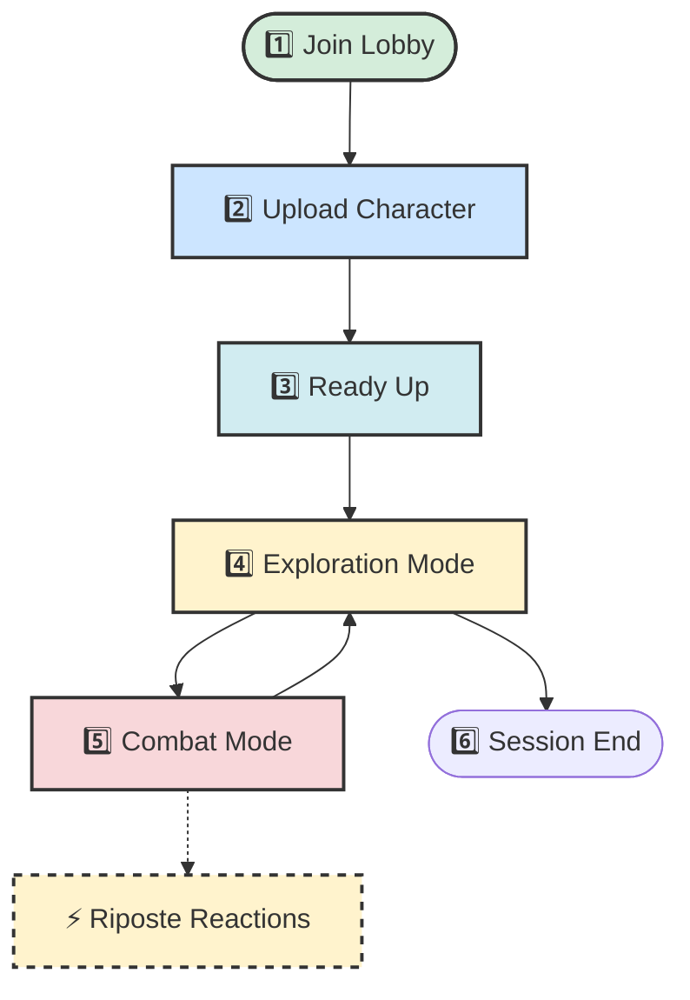

# 🎮 EldritchDM Player Guide

Welcome to the table! **EldritchDM** is your automated, never-sleeping, mathematically honest Dungeon Master. 

This guide will walk you through everything you need to know to roll initiative and survive your adventure. 🛡️⚔️

---

## 🗺️ The Core Workflow

Here is how a typical session flows from start to finish:

---

## 1️⃣ Joining the Game 🎲

When the DM runs `/start_game`, a **Lobby Embed** will appear in the channel.

- **One Channel = One Campaign**. Keep all your actions in the dedicated campaign channel.
- If you don't have a character yet, you'll be marked with a ⌛.

## 2️⃣ Uploading Your Character 📄

You can't play without stats! EldritchDM supports multiple ways to bring your character to life:

- 🔗 `/upload_character_url` - Paste a **Public** D&D Beyond URL. (Fastest!)
- 📸 `/upload_character_file` - Upload a PDF or Image of your character sheet. We'll use AI to read it.
- ✍️ `/upload_character_manual` - Type your stats in manually if the other methods fail.

> 💡 **Tip:** Always double-check your stats in the confirmation modal before saving!

## 3️⃣ Ready Up ✅

Once your character is loaded, click the **Ready** button on the lobby embed. Once everyone is ready, the game begins!

---

## 4️⃣ Exploration Mode 🔦

Outside of combat, you are in **Exploration Mode**. The DM will describe the room, and you'll see a `[ 💬 Declare Action ]` button.

1. Click `[ 💬 Declare Action ]`.
2. Type what you want to do (up to 500 characters).
   *Example: "I carefully inspect the bookshelf for hidden compartments."*
3. The bot will wait up to 30 seconds for other players to declare their actions, then resolve everything at once!

## 5️⃣ Combat Mode ⚔️

When weapons are drawn, turn order matters! 

- The embed will show a ▶️ next to the current actor.
- **You can only click buttons on your turn!** The bot will reject out-of-turn actions.
- Target monsters using their IDs (e.g., `goblin-1`).

### ⚡ Ripostes & Reactions
If you are playing a class with reactions (like a **Battle Master Fighter**), you might see a special button pop up!

- If a monster misses you, a `[ ↩️ Riposte ]` button will appear for **8 seconds**.
- **Click it fast!** If you miss the window, the moment passes.

---

## 🛑 Ending the Game

Need to stop for the night? Just close Discord! EldritchDM remembers **everything**.
When you come back tomorrow, your HP, turn order, and room description will be exactly where you left them. 🧠✨
